# Laporan Praktikum Pertemuan 1 

## Pemilihan 
Kode Program: 

Output: 
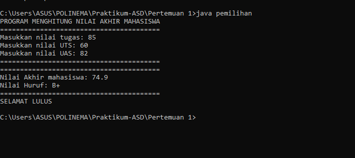

## Perulangan 
Kode Program: 

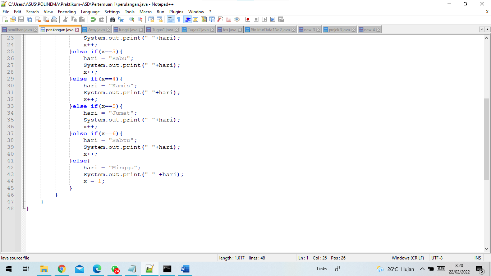

Output: 

## Array
Kode Program: 

Output: 
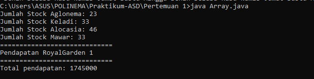

## Fungsi
Kode Program: 
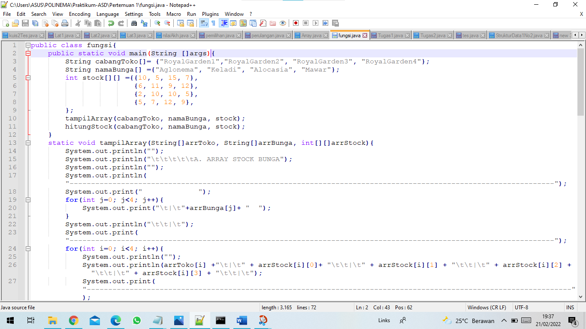
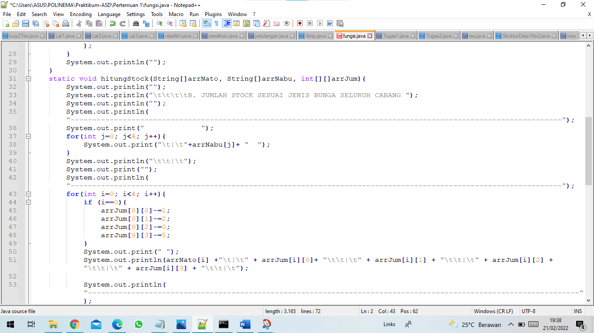
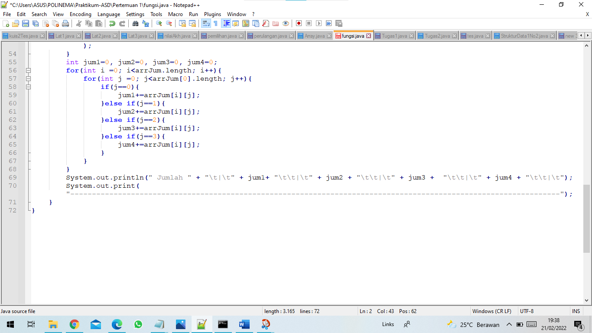

Output: 
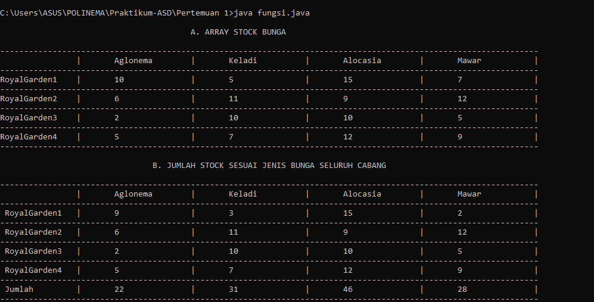

## Tugas1
Kode Program: 
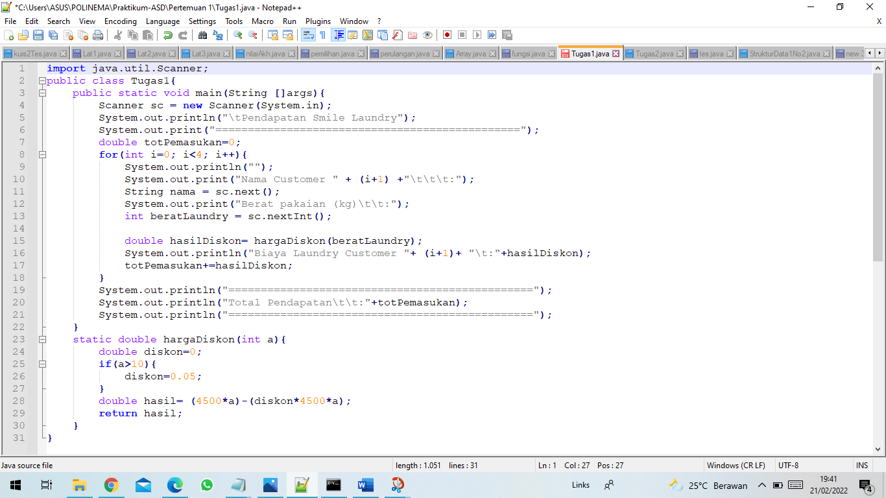

Output: 
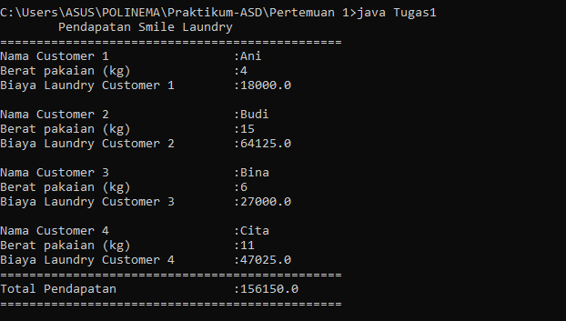

## Tugas2
Kode Program: 
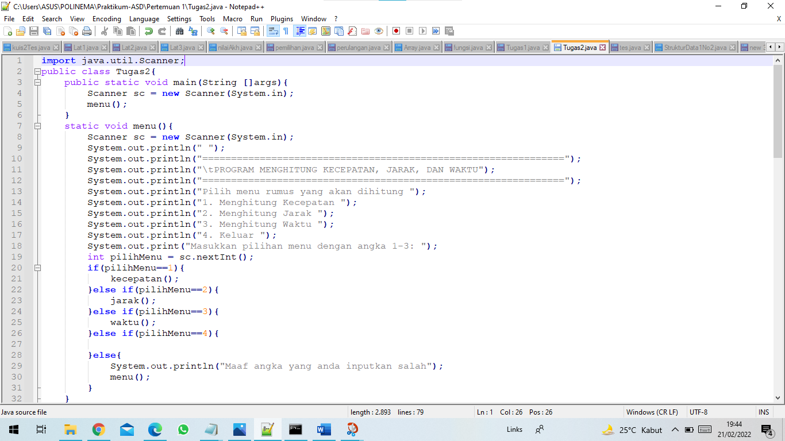
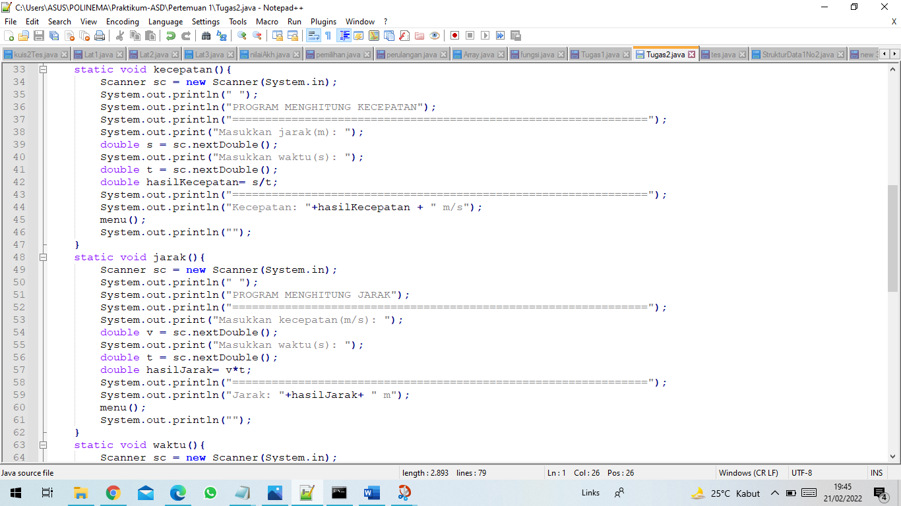
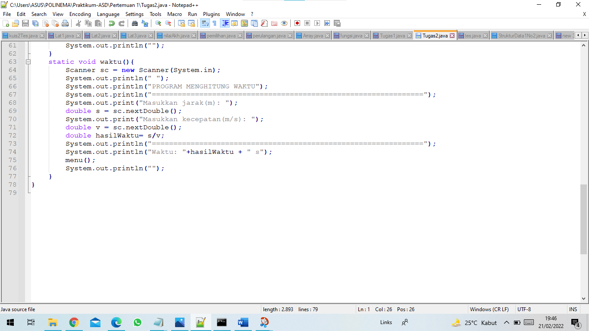

Output: 
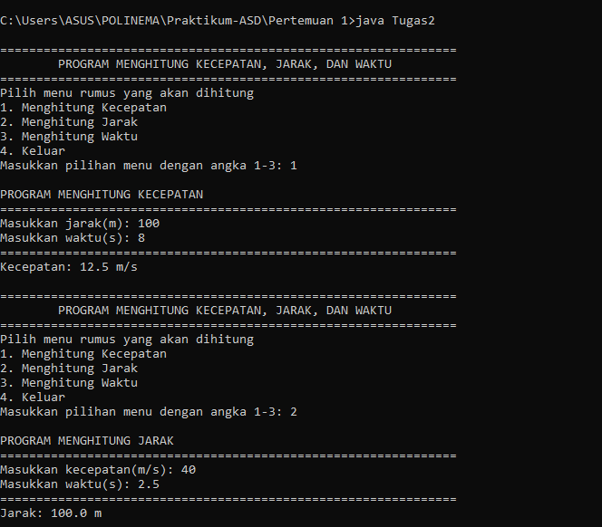
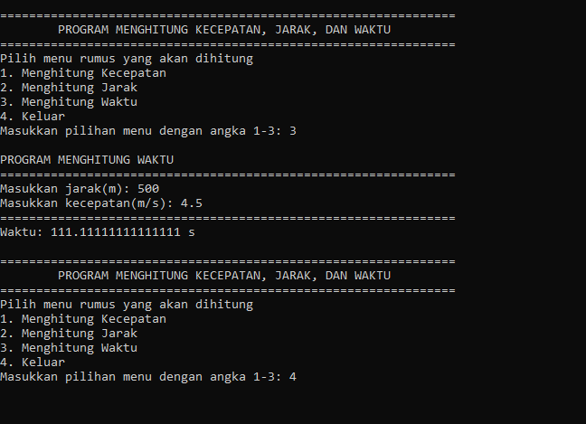

