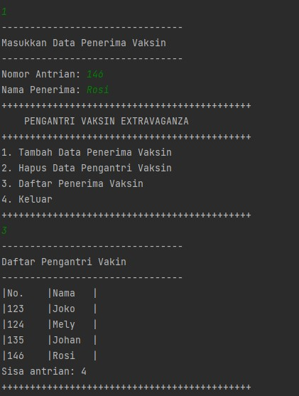
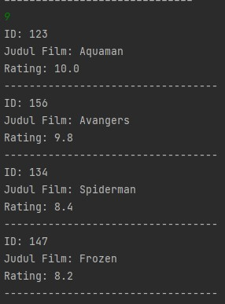

# Laporan Praktikum Pertemuan 12
oleh Desy Ayurianti - 1G D4 TI - 10 - 2141720119

##SubBab 12.2.3 Pertanyaan Percobaan 1

1. Jelaskan perbedaan antara single linked list dengan double linked lists!
**Single list hanya memiliki satu pointer saja yaitu pointer next dimana hanya menyimpan alamat sebuah node yang letaknya setelah dari satu node tertentu. Sedangkan single list memiliki dua pointer dimana pointer prev dan next. pointer prev digunakan untuk menyimpan alamat node sebelum node tertentu, jika pointer next untuk menyimpan alamat node yang letaknya di setlah node tertentu**
2. Perhatikan class Node, didalamnya terdapat atribut next dan prev. Untuk apakah atribut tersebut?
**Atribut next digunakan untuk menyimpan alamat node yang letaknya sebelum node tertentu. sedangkan next digunakan untuk menyimpan alamat node yang letaknya di setelah alamat node tertentu**
3. Perhatikan konstruktor pada class DoubleLinkedLists. Apa kegunaan inisialisasi atribut head dan
size seperti pada gambar berikut ini?
**Kegunaan inisialisasi atribut tersebut adalah untuk menginisialisasi kondisi awal yang masih belum ada node. Oleh karena itu karena belum ada node, maka head diset null(tidak ada data) dan sizenya 0**
4. Pada method addFirst(), kenapa dalam pembuatan object dari konstruktor class Node prev
dianggap sama dengan null?
```java
    Node newNode = new Node(null, item, head);
```
**konstruktor class Node prev dianggap null karena pada method add first artinya kita menambahkan data di awal. Artinya data yang akan dimasukkan akan menjadi data pertama. Oleh karena enjadi data pertama, otomatis tidak ada node lagi sebelumnya atau tidak ada data lagi sehingga dianggap nilai prevnya null**
5. Perhatikan pada method addFirst(). Apakah arti statement head.prev = newNode ?
**untuk mengenalkan kepada head bahwa saat ini sudah ada data sebelum head, dan head sendiri sudah tidak menjadi head lagi dan posisi head sekarang ada di setelah head yang baru**
6. Perhatikan isi method addLast(), apa arti dari pembuatan object Node dengan mengisikan
parameter prev dengan current, dan next dengan null?
```java
Node newNode = new Node(current, item, null);
```
**current disini sebagai duplikat dari head, dimana jika setelah head ada data lagi maka selnajutnya akan menduplikasi data setelah head ini, hal ini dilakukan berulang sampai berada di posisi data yang nilai nextnya tidak sama dengan null. Karena disini method add Last yang berarti menambah data di paling akhir, maka current ini akan terus berjalan sampai ke data sebelum data akhir. Maka dari itu nilai prev node baru merujuk pada posisi current tadi dan posisi nextnya menjadi null karena node baru ini menjadi node yang paling akhir sekarang yang artinya tidak ada data lagi setelahnya**


##SubBab 12.3.3 Pertanyaan Percobaan 2

1. Apakah maksud statement berikut pada method removeFirst()?
```java
head = head.next;
head.prev = null;
```
**head = head.next --> untuk mengenalkan bahwa head yang saat ini sudah berubah. Head saat ini sudah berada di posisi setelah head lama (head.next) karena adanya penghapusan data pertama**

**head.prev= null --> untuk mengenalkan bahwa head yang baru nilai prevnya sekarang null karena sudah ada di posisi paling awal yang artinya tidak ada data lagi sebelumnya maka dari itu head.prev menjadi null**

2. Bagaimana cara mendeteksi posisi data ada pada bagian akhir pada method removeLast()?
**dengan membuat duplikasi head dengan nama current. Setelah itu dilakukan perulangan pada current ini. jika nilai next pada sebuah data null, maka artinya data tersebut adalah data di posisi terakhir**
3. Jelaskan alasan potongan kode program di bawah ini tidak cocok untuk perintah remove!
```java
Node tmp = head.next;
head. next = tmp.next;
```
**Karena duplikasi melalui current tidak dari head. Harunysa duplikasinya dicek mulai dari head**
4. Jelaskan fungsi kode program berikut ini pada fungsi remove!
```java
current.prev.next = current.next;
current.next.prev = current. prev;
```
**1. current.prev.next = current.next; --> untuk mengenalkan bahwa nilai next data sebelum current berubah menjadi di posisi setelah current.**

**Ilustrasi:**

**A, B, C . data indeks 1 akan dihapus.**

**Maka disini dikenalkan bahwa nilai next dari A bukan lagi merujuk posisi B tetapi merujuk posisi C**

**2. current.next.prev = current. prev; --> untuk mengenalkan nilai prev dari data setelah current bukan lagi merujuk pada posisi current, tetapi merujuk pada posisi sebelum current**

**Ilustrasi:**

**A, B, C . data indeks 1 akan dihapus.**

**Maka disini dikenalkan bahwa nilai prev dari C buka ke posisi B lagi tetapi merujuk ke posisi A**

##SubBab 12.4.3 Pertanyaan Percobaan 3

1. Jelaskan method size() pada class DoubleLinkedLists!
**method size disni bertipe int dimana untuk menyimpan size dari node pada method lainnya di kelas DoubleLinkedLists maka dari itu ada syntax return size**
2. Jelaskan cara mengatur indeks pada double linked lists supaya dapat dimulai dari indeks ke - 1!
**melakukan perulangan dan menginisialisasikan indeks dengan 1**
3. Jelaskan perbedaan karakteristik fungsi Add pada Double Linked Lists dan Single Linked Lists!
**perbedaan karakteristik fungsi Add pada Double Linked Lists dan Single Linked Lists yakni jika pada single linked list operasi terbagi menjadi beberapa fungsi (insertafter, insertbefore, dan insert at), sedangkan pada double linked list menjadi satu fungsi yang berdasarkan indeks. Indeks yang akan ditambahkan dapat disisipkan di awal maupun akhir dari double linked list**

4. Jelaskan perbedaan logika dari kedua kode program di bawah ini!
**Gambar A Jika atribut size atau jumlah data bernilai 0, maka akan mereturn true atau kondisi tersebut adalah true.Jika tidak maka kondisi tersebut merupakan false. Pada gambar B Jika head atau data pada index pertama bernilai null, maka kondisi tersebut adalah true**


##Tugas
1. Syntax: 
```java
import java.util.Scanner;
class Node1{
    String dataNama;
    int dataAntrian;
    Node1 prev, next;

    Node1(Node1 prev, int dataAntrian, String dataNama, Node1 next){
        this.prev=prev;
        this.dataAntrian=dataAntrian;
        this.dataNama=dataNama;
        this.next=next;
    }
}
class DLList{
    Node1 head;
    int size;

    public DLList(){
        head=null;
        size=0;
    }
    public boolean isEmpty(){
        return head ==null;
    }
    public void addFirst(int noAntri, String nama){
        if(isEmpty()){
            head =new Node1(null, noAntri, nama, null);
        }else{
            Node1 newNode = new Node1(null, noAntri, nama, head);
            head.prev=newNode;
            head=newNode;
        }
        size++;
    }
    public void addLast(int noAntri, String nama){
        if(isEmpty()){
            addFirst(noAntri, nama);
        }else{
            Node1 current = head;
            while (current.next !=null){
                current=current.next;
            }
            Node1 newNode = new Node1(current, noAntri, nama, null);
            current.next=newNode;
            size++;
        }
    }
    public void removeFirst() throws Exception{
        if(isEmpty()){
            throw new Exception("Linked List masih kodsong, tidak dapat dihapus");
        }else if(size==1){
            removeLast();
        }else{
            System.out.println(head.dataNama + " telah selesai divaksinasi");
            head=head.next;
            head.prev=null;
            size--;
        }
    }
    public void removeLast() throws Exception{
        if(isEmpty()){
            throw new Exception("Linked List masih kosong, tidak dapat dihapus!");
        }else if(head.next==null){
            head=null;
            size--;
            return;
        }
        Node1 current = head;
        while(current.next.next !=null){
            current=current.next;
        }
        current.next=null;
        size--;
    }
    public void remove(int index) throws Exception{
        if(isEmpty() || index>=size){
            throw new Exception("Nilai indeks di luar batas");
        }else if(index==0){
            removeFirst();
        }else{
            Node1 current = head;
            int i =0;
            while (i<index){
                current=current.next;
                i++;
            }
            if(current.next==null){
                current.prev.next=null;
            }else if(current.prev==null){
                current=current.next;
                current.prev=null;
                head=current;
            }else{
                current.prev.next=current.next;
                current.next.prev=current.prev;
            }
            System.out.println(current.dataNama + " telah selesai divaksinasi");
            size--;
        }
    }
    public void print(){
        if(!isEmpty()){
            Node1 tmp = head;
            System.out.println("|No.\t|Nama\t|");
            while (tmp!=null){
                System.out.println("|"+ tmp.dataAntrian +"\t|"+ tmp.dataNama+"\t|");
                tmp=tmp.next;
            }
        }else{
            System.out.println("Linked Lists kosong");
        }
    }
    public int size(){
        return size;
    }
}
public class TugasNo1 {
    public static void main(String[] args) throws Exception {
        Scanner sc = new Scanner(System.in);
        DLList DLLVaksin= new DLList();

        for(;;){
            menu();
            int pilih = sc.nextInt();
            if(pilih==1){
                System.out.println("--------------------------------");
                System.out.println("Masukkan Data Penerima Vaksin");
                System.out.println("--------------------------------");
                System.out.print("Nomor Antrian: ");
                int no = sc.nextInt();
                System.out.print("Nama Penerima: ");
                String nama= sc.next();
                DLLVaksin.addLast(no, nama);
            }else if(pilih==2){
                System.out.println("--------------------------------");
                System.out.println("Masukkan Index Antrian yang ingin dihapus");
                System.out.println("--------------------------------");
                int no = sc.nextInt();
                DLLVaksin.remove(no);
            }else if(pilih==3){
                System.out.println("--------------------------------");
                System.out.println("Daftar Pengantri Vakin");
                System.out.println("--------------------------------");
                DLLVaksin.print();
                DLLVaksin.size();
                System.out.println("Sisa antrian: " + DLLVaksin.size);
            }else if(pilih==4){
                System.out.println("Terimakasih");
                break;
            }else{
                System.out.println("Input salah!");
            }
        }
    }
    public static void menu(){
        System.out.println("++++++++++++++++++++++++++++++++++++++++++++");
        System.out.println("\tPENGANTRI VAKSIN EXTRAVAGANZA");
        System.out.println("++++++++++++++++++++++++++++++++++++++++++++");
        System.out.println("1. Tambah Data Penerima Vaksin");
        System.out.println("2. Hapus Data Pengantri Vaksin");
        System.out.println("3. Daftar Penerima Vaksin");
        System.out.println("4. Keluar");
        System.out.println("++++++++++++++++++++++++++++++++++++++++++++");
    }

}
```

Output: 





2. 
```java
import java.util.Scanner;
class NodeFilm{
    int dataId;
    String dataJudul;
    float dataRating;
    NodeFilm prev, next;

    NodeFilm(NodeFilm prev, int id, String judul, float rating, NodeFilm next){
        this.prev=prev;
        this.dataId=id;
        this.dataJudul=judul;
        this.dataRating=rating;
        this.next=next;
    }
}
class DLLFilm{
    NodeFilm head;
    int size;

    public DLLFilm(){
        head=null;
        size=0;
    }
    public boolean isEmpty(){

        return head ==null;
    }
    public void addFirst(int id, String judul, float rating){
        if(isEmpty()){
            head =new NodeFilm(null, id, judul, rating, null);
        }else{
            NodeFilm newNode = new NodeFilm(null, id, judul, rating, head);
            head.prev=newNode;
            head=newNode;
        }
        size++;
    }
    public void addLast(int id, String judul, float rating){
        if(isEmpty()){
            addFirst(id, judul, rating);
        }else{
            NodeFilm current = head;
            while (current.next !=null){
                current=current.next;
            }
            NodeFilm newNode = new NodeFilm(current, id, judul, rating, null);
            current.next=newNode;
            size++;
        }
    }
    public void add(int id, String judul, float rating, int index ) throws Exception{
        if(isEmpty()){
            addFirst(id, judul, rating);
        }else if (index<0 || index>size){
            throw new Exception("Nilai indeks di luar batas");
        }else{
            NodeFilm current = head;
            int i=0;
            while(i<index){
                current = current.next;
                i++;
            }
            if(current.prev==null){
                NodeFilm newNode = new NodeFilm(null, id, judul, rating, current);
                current.prev=newNode;
                head=newNode;
            }else{
                NodeFilm newNode = new NodeFilm(current, id, judul, rating, current);
                newNode.prev=current.prev;
                newNode.next=current;
                current.prev.next=newNode;
                current.prev=newNode;
            }
        }
        size++;
    }
    public int size(){
        return size;
    }
    public void clear(){
        head=null;
        size=0;
    }
    public void print(){
        if(!isEmpty()){
            NodeFilm tmp = head;
            while (tmp!=null){
                System.out.println("ID:\t"+ tmp.dataId );
                System.out.println("Judul Film:\t" +tmp.dataJudul);
                System.out.println("Rating:\t" +tmp.dataRating);
                System.out.println("----------------------------------");
                tmp=tmp.next;
            }
        }else{
            System.out.println("Linked Lists kosong");
        }
    }
    public void removeFirst() throws Exception{
        if(isEmpty()){
            throw new Exception("Linked List masih kosong");
        }else if(size==1){
            removeLast();
            System.out.println("Data berhasil dihapus");
        }else{
            head=head.next;
            head.prev=null;
            size--;
            System.out.println("Data Pertama berhasil dihapus");
            //System.out.println("Data Id: " + head.dataId + "\nData Judul: " + head.dataJudul +"\nData Rating: "+ head.prev.dataRating + "\nberhasil dihapus");
        }
    }
    public void removeLast() throws Exception{
        if(isEmpty()){
            throw new Exception("Linked List masih kosong");
        }else if(head.next==null){
            head=null;
            size--;
            return;
        }
        NodeFilm current = head;
        while(current.next.next !=null){
            current=current.next;
        }
        current.next=null;
        size--;
        System.out.println("Data Terakhir berhasil dihapus");

    }
    public void remove(int index) throws Exception{
        index-=1;
        if(isEmpty() || index>=size){
            throw new Exception("Nilai indeks di luar batas");
        }else if(index==0){
            removeFirst();
        }else{
            NodeFilm current = head;
            int i =0;
            while (i<index){
                current=current.next;
                i++;
            }
            if(current.next==null){
                current.prev.next=null;
            }else if(current.prev==null){
                current=current.next;
                current.prev=null;
                head=current;
            }else{
                current.prev.next=current.next;
                current.next.prev=current.prev;
            }
            size--;
            System.out.println("Data urutan ke-" +(index+1) + " berhasil dihapus");
        }
    }
    public int get(int index) throws Exception{
        /*if(isEmpty() || index >=size){
            throw new Exception("Nilai indeks di luar batas");
        }*/
        NodeFilm tmp = head;
        for(int i=0; i<index; i++) {
            tmp = tmp.next;
        }
        return tmp.dataId;
    }

    int getId(int p){
        NodeFilm index = head;
        int tmp = 0;
        for(int i=0; i<size; i++){
            if(p == index.dataId){
                tmp = tmp;
            } else{
                index = index.next;
                tmp++;
            }
        }
        /*index = head;
        for(int i=0;i<tmp;i++){
            index=index.next;
        }*/
        tmp++;
        System.out.println("Data id film: " + p + " berada di node ke-" + tmp);
        System.out.println("IDENTITAS: ");
        System.out.println("ID Film: " +index.dataId);
        System.out.println("Judul: " +index.dataJudul);
        System.out.println("Rating: " +index.dataRating);
        return tmp;
    }
    void BubbleSort(){
        int x;
        NodeFilm tmp;
        NodeFilm tmp1 = null;
        if(head==null){
            return;
        }
        do{
            x=0;
            tmp=head;
            while(tmp.next!=tmp1){
                if(tmp.dataRating<tmp.next.dataRating){
                    float y = tmp.dataRating;
                    tmp.dataRating=tmp.next.dataRating;
                    tmp.next.dataRating=y;
                    x=1;
                }
                tmp=tmp.next;
            }
            tmp1=tmp;
        }while (x!=0);
    }


}

public class TugasNo2 {
    public static void main(String[] args) throws Exception {
        Scanner sc = new Scanner(System.in);
        DLLFilm DLLFm = new DLLFilm();
        int id;
        String judul;
        float rating;
        for(;;){
            menuFilm();
            int pilih = sc.nextInt();
            if(pilih==1){
                System.out.println("Masukkan Data Film Posisi Awal");
                System.out.print("ID Film: ");
                id = sc.nextInt();
                System.out.print("Judul Film: ");
                judul =sc.next();
                System.out.print("Rating Film: ");
                rating= sc.nextFloat();
                DLLFm.addFirst(id, judul,rating);
            }else if(pilih==2){
                System.out.println("Masukkan Data Film Posisi Akhir");
                System.out.print("ID Film: ");
                 id = sc.nextInt();
                System.out.print("Judul Film: ");
                judul =sc.next();
                System.out.print("Rating Film: ");
                rating= sc.nextFloat();
                DLLFm.addLast(id, judul,rating);
            }else if(pilih==3){
                System.out.println("Masukkan index: ");
                int urutan = sc.nextInt();
                System.out.println("Masukkan Data Film index  " + urutan);
                System.out.print("ID Film: ");
                id = sc.nextInt();
                System.out.print("Judul Film: ");
                judul =sc.next();
                System.out.print("Rating Film: ");
                rating= sc.nextFloat();
                DLLFm.add(id, judul, rating, urutan);

            }else if(pilih==4){
                DLLFm.removeFirst();
            }else if(pilih==5){
                DLLFm.removeLast();
            }else if(pilih==6){
                System.out.println("Masukkan urutan yang akan dihapus");
                int urutan = sc.nextInt();
                DLLFm.remove(urutan);

            }else if(pilih==7){
                System.out.println("Cetak Data");
                System.out.println("----------------------------------");
                DLLFm.print();

            }else if(pilih==8){
                System.out.println("Masukkan ID Film: ");
                id = sc.nextInt();
                DLLFm.getId(id);

            }else if(pilih==9){
                DLLFm.BubbleSort();
                DLLFm.print();

            }else if(pilih==10){
                System.out.println("Terimakasih");
                break;
            }else{
                System.out.println("Inputan salah!");
            }

        }

    }
    public static void menuFilm(){
        System.out.println("==============================");
        System.out.println("DATA FILM LAYAR LEBAR");
        System.out.println("==============================");
        System.out.println("1. Tambah Data Awal");
        System.out.println("2. Tambah Data Akhir");
        System.out.println("3. Tambah Data Index Tertentu");
        System.out.println("4. Hapus Data Pertama");
        System.out.println("5. Hapus Data Terakhir");
        System.out.println("6. Hapus Data Tertentu");
        System.out.println("7. Cetak");
        System.out.println("8. Cari ID Film");
        System.out.println("9. Urut Data Rating Film-DESC");
        System.out.println("10. Keluar");
        System.out.println("==============================");
    }

}
```

Output:
Menu 1, 2, 3 


Menu 7 


Menu 8


Menu 9



