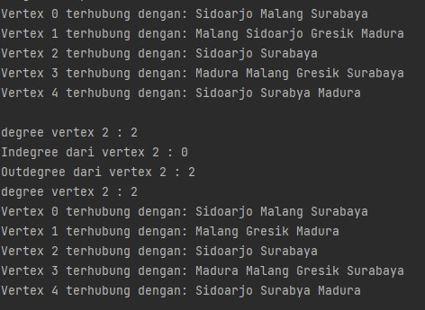

# Laporan Praktikum Pertemuan 14
oleh Desy Ayurianti - 1G D4 TI - 2141720119


## SubBab 2.1.3
1. Sebutkan beberapa jenis (minimal 3) algoritma yang menggunakan dasar Graph, dan apakah
   kegunaan algoritma-algoritma tersebut?

   **Algoritma Bellman-Ford yang digunakan untuk mencari lintasan yang paling pendek, Algoritma Boruvka yang digunakan untuk pencarian jalur, Algoritma kruskal untuk mencari minimum spanning tree (MST) pada sebuah graf**
2. Pada class Graph terdapat array bertipe LinkedList, yaitu LinkedList list[]. Apakah tujuan
   pembuatan variabel tersebut ?

   **Untuk memanggil objek Linked list dalam array yang nantinya akan menyimpan vertex dan indeks tiap vertexnya**
3. Apakah alasan pemanggilan method addFirst() untuk menambahkan data, bukan method add
   jenis lain pada linked list ketika digunakan pada method addEdge pada class Graph?

   **Karena agar dapat mengenali vertex dari depan. Jadi sambungan ada di awal.**
4. Bagaimana cara mendeteksi prev pointer pada saat akan melakukan penghapusan suatu edge
   pada graph ?

   **Dengan menggunakan looping edge dimana bila i masih kurang dari list size vertex dan jika destinasi yg diinput sama dengan list vertex maka akan meremove dengan menggunakan method remove yang ada di class LinkedList**
5. Kenapa pada praktikum 2.1.1 langkah ke-12 untuk menghapus path yang bukan merupakan
   lintasan pertama kali menghasilkan output yang salah ? Bagaimana solusinya ?
   
   **Mengubah sintaks removeEdge menjadi:**
   ```java
   void removeEdge(int source, int destination) throws Exception{
        for(int i=0; i<list[source].size(); i++){
            if(list[source].get(i)==destination){
                list[source].remove(i);
                break;
            }
        }
    }
   ```


## SubBab 2.2.3
1. Apakah perbedaan degree/derajat pada directed dan undirected graph?

   **Degree pada directed memilik degree yang keluar vertex dan masuk vertex karen grpah ini sendiri merupakan graph yang berarah. Sedangkan Degree pada undirected tidak memliki degree masuk(indegree) atau keluar(outdegree) karen graphnya tidak memliki arah**
2. Pada implementasi graph menggunakan adjacency matriks. Kenapa jumlah vertices harus
   ditambahkan dengan 1 pada indeks array berikut?

   ```java
    public graphArray(int v) {
        vertices=v;
        twoD_array=new int[vertices+1][vertices+1];
    } 
   
   ```

   **Vertices harus ditambah satu karena array sendiri dimulai dari 0 (jumlah nya pasti array-1), maka dari itu untuk menyesuaikan antara array dan verticesnya maka vertices ditambah dengan 1**
3. Apakah kegunaan method getEdge() ?

   **getEdge digunakan menampilkan nilai dari vertex satu ke vertex lainnya itu berapa**
4. Termasuk jenis graph apakah uji coba pada praktikum 2.2?

   **termasuk graph directed**
5. Mengapa pada method main harus menggunakan try-catch Exception ?

   **Agar ketika ada error program tidak dihentian secara langsung, melainkan tetap berjalan**


## SubBab 3 

1. Ubahlah lintasan pada praktikum 2.1 menjadi inputan!

Source Code Class Graph:
```java
public class Graph {
   int vertex;
   DoubleLinkedList list[];
   
   Graph(int vertex) {
      this.vertex = vertex; // nilai atribut vrtex sama kaya nilai parameter
      list = new DoubleLinkedList[vertex]; // list sizenya ngikutin prameter vertex
      for (int i = 0; i < vertex; i++) {
         list[i] = new DoubleLinkedList();// isi dari vertex
      }
   }

   public void addEdge(int source, int destination) {
      list[source].addFirst(destination);
      list[destination].addFirst(source);
   }

   void degree(int source) throws Exception {
      //undirected
      System.out.println("degree vertex " + source + " : " + list[source].size());

      //directed
      int k, totalIn = 0, totalOut = 0;
      for (int i = 0; i < vertex; i++) {//melihat semua vertex
         for (int j = 0; j < list[i].size(); j++) {//diulangan untuk degree vertex
            if (list[i].get(j) == source) {//untuk semua size di vertex
               //4==4
               ++totalIn;
            }

         }
         //out
         for (k = 0; k < list[source].size(); k++) {
            list[source].get(k);//mana yang terhubung
         }
         totalOut = k;
      }
      System.out.println("Indegree dari vertex " + source + " : " + totalIn);
      System.out.println("Outdegree dari vertex " + source + " : " + totalOut);
      System.out.println("degree vertex " + source + " : " + (totalIn + totalOut));
   }

   void removeEdge(int source, int destination) throws Exception {
      for (int i = 0; i < list[source].size(); i++) {
         if (list[source].get(i) == destination) {
            list[source].remove(i);
            break;
         }
      }
   }

   void removeAllEdges() {
      for (int i = 0; i < vertex; i++) {
         list[i].clear();
      }
      System.out.println("Graph sudah kosong");
   }

   public void printGraph() throws Exception {
      for (int i = 0; i < vertex; i++) {
         if (list[i].size() > 0) {//vertex ada isinya //0 krna mau nyari dan cetak hubungan dari vertex
            System.out.print("Vertex " + i + " terhubung dengan: ");
            for (int j = 0; j < list[i].size(); j++) {//list yang mau dicetak
               System.out.print(list[i].get(j) + " ");
            }
            System.out.println("");
         }
      }
      System.out.println(" ");
   }
}
```

Source Code Main: 
```java
import java.util.Scanner;
public class GraphLinkedListMain {
    public static void main(String[] args) throws Exception {
       Scanner sc = new Scanner(System.in);
       
       //Tugas No 1
       int jumGraph, s, d;
       System.out.println("Masukkan jumlah vertex: ");
       jumGraph = sc.nextInt();

       Graph graph = new Graph(jumGraph);
       System.out.println("Masukkan edges: <source> <destination>");
       s = sc.nextInt();
       d = sc.nextInt();
       graph.addEdge(s, d);
       int i = 0;
       while (i < jumGraph) {
          s = sc.nextInt();
          d = sc.nextInt();

          graph.addEdge(s, d);
          i++;
       }
       s = sc.nextInt();
       d = sc.nextInt();
       graph.addEdge(s, d);

       graph.printGraph();
       graph.degree(2);
       graph.removeEdge(1, 2);
       graph.printGraph();

    }
```

Output: 


2. Tambahkan method graphType dengan tipe boolean yang akan membedakan graph termasuk
   directed atau undirected graph. Kemudian update seluruh method yang berelasi dengan method
   graphType tersebut (hanya menjalankan statement sesuai dengan jenis graph) pada praktikum
   2.1

Source Code Graph: 
```java
public class Graph {
    int vertex;
    DoubleLinkedList list[];
    boolean choose;
    
    //Graph for Tugas No 2
    Graph(int vertex, boolean choose){
        this.vertex=vertex; // nilai atribut vrtex sama kaya nilai parameter
        this.choose=choose;
        list= new DoubleLinkedList[vertex]; // list sizenya ngikutin prameter vertex
        for(int i =0; i<vertex; i++){
            list[i]=new DoubleLinkedList();// isi dari vertex
        }
    }

    void addEdge(int source, int destination){//tambah edge harus definisikan dari vertex mana ke mana
        if(graphType(choose)){
            list[source].addFirst(destination);

        }else{
            list[source].addFirst(destination);//sambungan : yg awal
            list[destination].addFirst(source);
        }

    }
    void degree(int source) throws Exception{
        if(graphType(choose)){
            int k, totalIn=0, totalOut=0;
            for(int i=0; i<vertex; i++){//melihat semua vertex
                for (int j=0; j<list[i].size(); j++){//diulangan untuk degree vertex
                    if(list[i].get(j)==source){//untuk semua size di vertex
                        //4==4
                        ++totalIn;
                    }
                }
                //out
                for(k=0; k<list[source].size(); k++){
                    list[source].get(k);//mana yang terhubung
                }
                totalOut=k;
            }
            System.out.println("Indegree dari vertex " + source + " : " + totalIn);
            System.out.println("Outdegree dari vertex " + source + " : " + totalOut);
            System.out.println("degree vertex " + source + " : " + (totalIn + totalOut));
        }else{
            //undirected
            System.out.println("degree vertex " + source + " : " + list[source].size());
        }


    }
    void removeEdge(int source, int destination) throws Exception{
        for(int i=0; i<list[source].size(); i++){
            if(list[source].get(i)==destination){
                list[source].remove(i);
                break;
            }
        }
    }
    void removeAllEdges(){
        for(int i=0; i<vertex; i++){
            list[i].clear();
        }
        System.out.println("Graph sudah kosong");
    }
    public void printGraph() throws Exception{
        for(int i=0; i<vertex; i++){
            if(list[i].size()>0){//vertex ada isinya //0 krna mau nyari dan cetak hubungan dari vertex
                System.out.print("Vertex " + i + " terhubung dengan: ");
                for(int j=0; j<list[i].size(); j++){//list yang mau dicetak
                    System.out.print(list[i].get(j) + " ");
                }
                System.out.println("");
            }
        }
        System.out.println(" ");
    }
    boolean graphType(boolean pilih){
        return pilih;
    }
```

Source Code main: 
```java
import java.util.Scanner;
public class GraphLinkedListMain {
    public static void main(String[] args) throws Exception {
       Scanner sc = new Scanner(System.in);
       // Tugas No2
       int pilihGraph;
       boolean pilih;
       int jumGraph, s, d;
       System.out.println("Pilih jenis graph");
       System.out.println("1. Directed");
       System.out.println("2. Undirected");
       System.out.print("Pilih 1-2: ");
       pilihGraph = sc.nextInt();

       if (pilihGraph == 1) {
          System.out.println("DIRECTED GRAPH");
          pilih = true;
       } else if (pilihGraph == 2) {
          System.out.println("UNDIRECTED GRAPH");
          pilih = false;
       } else {
          System.out.println("Inputan Salah!");
          pilih = false;
       }

       System.out.println("Masukkan jumlah vertex: ");
       jumGraph = sc.nextInt();
       Graph graph = new Graph(jumGraph, pilih);
       System.out.println("Masukkan edges: <source> <destination>");
       s = sc.nextInt();
       d = sc.nextInt();
       graph.addEdge(s, d);
       int i = 0;
       while (i < jumGraph) {
          s = sc.nextInt();
          d = sc.nextInt();

          graph.addEdge(s, d);
          i++;
       }
       s = sc.nextInt();
       d = sc.nextInt();
       graph.addEdge(s, d);
       graph.printGraph();
       graph.degree(2);
       graph.removeEdge(1, 2);
       graph.printGraph();
    }
```
Output:

Directed:


Indirected:


3. Modifikasi method removeEdge() pada praktikum 2.1 agar tidak menghasilkan output yang salah
untuk path selain path pertama kali!

Source Code: 
```java
void removeEdge(int source, int destination) throws Exception{
        for(int i=0; i<list[source].size(); i++){
            if(list[source].get(i)==destination){
                list[source].remove(i);
                break;
            }
        }
    }
```
Main: 
```java
import java.util.Scanner;
public class GraphLinkedListMain {
    public static void main(String[] args) throws Exception {
        Scanner sc = new Scanner(System.in);
        //Tugas No3
        int jumGraph, s, d;
        System.out.println("Masukkan jumlah vertex: ");
        jumGraph = sc.nextInt();

        Graph graph = new Graph(jumGraph);
        System.out.println("Masukkan edges: <source> <destination>");
        s = sc.nextInt();
        d = sc.nextInt();
        graph.addEdge(s,d);
        int i=0;
        while (i<jumGraph){
            s = sc.nextInt();
            d = sc.nextInt();

            graph.addEdge(s,d);
            i++;
        }
        s = sc.nextInt();
        d = sc.nextInt();
        graph.addEdge(s,d);

        graph.printGraph();
        graph.degree(2);
        graph.removeEdge(1,3);
        graph.printGraph();

```

Output:


4. Ubahlah tipe data vertex pada seluruh graph pada praktikum 2.1 dan 2.2 dari Integer menjadi
tipe generic agar dapat menerima semua tipe data dasar Java! Misalnya setiap vertex yang
awalnya berupa angka 0,1,2,3, dst. selanjutnya ubah menjadi suatu nama daerah seperti Gresik,
Bandung, Yogya, Malang, dst

Source Code Node: 
```java
public class Node {
    String data;
    Node prev, next;

    Node(Node prev, String data, Node next){
        this.prev=prev;
        this.data=data;
        this.next=next;
    }
}
```

Source Code DoubleLinkedList:
```java
public class DoubleLinkedList {
    Node head;
    int size;

    public DoubleLinkedList(){
        head=null;
        size=0;
    }
    public boolean isEmpty(){
        return head ==null;
    }
    public void addFirst(String item){
        if(isEmpty()){
            head =new Node(null, item, null);
        }else{
            Node newNode = new Node(null, item, head);
            head.prev=newNode;
            head=newNode;
        }
        size++;
    }
    public void addLast(String item){
        if(isEmpty()){
            addFirst( item);
        }else{
            Node current = head;
            while (current.next !=null){
                current=current.next;
            }
            Node newNode = new Node(current, item, null);
            current.next=newNode;
            size++;
        }
    }
    public void add(String item, int index ) throws Exception{
        if(isEmpty()){
            addFirst(item);
        }else if (index<0 || index>size){
            throw new Exception("Nilai indeks di luar batas");
        }else{
            Node current = head;
            int i=0;
            while(i<index){
                current = current.next;
                i++;
            }
            if(current.prev==null){
                Node newNode = new Node(null, item, current);
                current.prev=newNode;
                head=newNode;
            }else{
                Node newNode = new Node(current, item, current);
                newNode.prev=current.prev;
                newNode.next=current;
                current.prev.next=newNode;
                current.prev=newNode;
            }
        }
        size++;
    }
    public int size(){

        return size;
    }
    public void clear(){
        head=null;
        size=0;
    }
    public void print(){
        if(!isEmpty()){
            Node tmp = head;
            while (tmp!=null){
                System.out.println(tmp.data + "\t");
                tmp=tmp.next;
            }
            System.out.println("\nberhasil diisi");
        }else{
            System.out.println("Linked Lists kosong");
        }
    }
    public void removeFirst() throws Exception{
        if(isEmpty()){
            throw new Exception("Linked List masih kosong, tidak dapat dihapus");
        }else if(size==1){
            removeLast();
        }else{
            head=head.next;
            head.prev=null;
            size--;
        }
    }
    public void removeLast() throws Exception{
        if(isEmpty()){
            throw new Exception("Linked List masih kosong, tidak dapat dihapus!");
        }else if(head.next==null){
            head=null;
            size--;
            return;
        }
        Node current = head;
        while(current.next.next !=null){
            current=current.next;
        }
        current.next=null;
        size--;
    }
    public void remove(int index) throws Exception{
        if(isEmpty() || index>=size){
            throw new Exception("Nilai indeks di luar batas");
        }else if(index==0){
            removeFirst();
        }else{
            Node current = head;
            int i =0;
            while (i<index){
                current=current.next;
                i++;
            }
            if(current.next==null){
                current.prev.next=null;
            }else if(current.prev==null){
                current=current.next;
                current.prev=null;
                head=current;
            }else{
                current.prev.next=current.next;
                current.next.prev=current.prev;
            }
            size--;
        }
    }
    public String getFirst() throws Exception{
        if(isEmpty()){
            throw new Exception("Linked List Kosong");
        }
        return head.data;
    }
    public String getLast() throws Exception{
        if (isEmpty()){
            throw new Exception("Linked List kosong");
        }
        Node tmp = head;
        while (tmp.next != null){
            tmp=tmp.next;
        }
        return tmp.data;
    }
    public String  get(int index) throws Exception{
        if(isEmpty() || index >=size){
            throw new Exception("Nilai indkes di luar batas");
        }
        Node tmp = head;
        for(int i=0; i<index; i++) {
            tmp = tmp.next;
        }
        return tmp.data;
    }
}
```

Source Code Graph:
```java
public class Graph {
    int vertex;
    DoubleLinkedList list[];

    Graph(int vertex){
        this.vertex=vertex; // nilai atribut vrtex sama kaya nilai parameter
        list= new DoubleLinkedList[vertex]; // list sizenya ngikutin prameter vertex
        for(int i =0; i<vertex; i++){
            list[i]=new DoubleLinkedList();// isi dari vertex
        }
    }

    void addEdge(int idx, int idx2, String source, String destination){//tambah edge harus definisikan dari vertex mana ke mana
        list[idx].addFirst(destination);

        list[idx2].addFirst(source);//sambungan : yg awal

    }

    void degree(int source) throws Exception{
        //undirected
        System.out.println("degree vertex " + source + " : " + list[source].size());

        //directed
        int k, totalIn=0, totalOut=0;
        for(int i=0; i<vertex; i++){//melihat semua vertex
            for (int j=0; j<list[i].size(); j++){//diulangan untuk degree vertex
                if(list[i].get(j).equalsIgnoreCase(String.valueOf(source))){//untuk semua size di vertex
                    //4==4
                    ++totalIn;
                }

            }
            //out
            for(k=0; k<list[source].size(); k++){
                list[source].get(k);//mana yang terhubung
            }
            totalOut=k;
        }
        System.out.println("Indegree dari vertex " + source + " : " + totalIn);
        System.out.println("Outdegree dari vertex " + source + " : " + totalOut);
        System.out.println("degree vertex " + source + " : " + (totalIn + totalOut));
    }
    void removeEdge(int source, String  destination) throws Exception{
        for(int i=0; i<list[source].size(); i++){
            if(list[source].get(i).equalsIgnoreCase(destination)){
                list[source].remove(i);
                break;
            }
        }
    }
    void removeAllEdges(){
        for(int i=0; i<vertex; i++){
            list[i].clear();
        }
        System.out.println("Graph sudah kosong");
    }
    public void printGraph() throws Exception{
        for(int i=0; i<vertex; i++){
            if(list[i].size()>0){//vertex ada isinya //0 krna mau nyari dan cetak hubungan dari vertex
                System.out.print("Vertex " + i + " terhubung dengan: ");
                for(int j=0; j<list[i].size(); j++){//list yang mau dicetak
                    System.out.print(list[i].get(j) + " ");
                }
                System.out.println("");
            }
        }
        System.out.println(" ");
    }
    boolean graphType(boolean pilih){
        return pilih;
    }
}
```

Source Code Main:
```java
public class GraphMain{
    public static void main(String[] args) throws Exception {
            //Tugas No 4
            Graph graph = new Graph(6);

            //0 = Madura
            //1 = Surabaya
            //2 = Gresik
            //3 = Sidoarjo
            //4 = Malang


            graph.addEdge(0, 1, "Madura", "Surabaya");
            graph.addEdge(0, 4, "Madura", "Malang");
            graph.addEdge(1, 2, "Surabaya", "Gresik");
            graph.addEdge(1, 3, "Surabaya", "Sidoarjo");
            graph.addEdge(1, 4, "Surabya", "Malang");
            graph.addEdge(2, 3, "Gresik", "Sidoarjo");
            graph.addEdge(3, 4, "Sidoarjo", "Malang");
            graph.addEdge(3, 0, "Sidoarjo", "Madura");

            graph.printGraph();
            graph.degree(2);
            graph.removeEdge(1, "Sidoarjo");
            graph.printGraph();
        }
    }
```

Output:


