# Laporan Praktikum Pretemuan 16 
oleh Desy Ayurianti - TI 1G - 10 - 2141720119 

## Sub Bab 16.2.3. 
1. Perhatikan baris kode 25-36, mengapa semua jenis data bisa ditampung ke dalam sebuah
   Arraylist?

    **semua jenis data bisa ditampung dalam ArrayList karena saat deklarasi ArrayList tersebut tidak disebutkan tipe data yang spesifik, sehingga program bisa menerima semua jenis data**

2. Modifikasi baris kode 25-36 seingga data yang ditampung hanya satu jenis atau spesifik tipe
   tertentu!
```java
   List <Integer> l = new ArrayList();
        l.add(1);
        l.add(2);
        l.add(3);
        l.add(4);
        System.out.printf("Elemen 0: %d total elemen: %d elemen terakhir: " +
         "%s\n", l.get(0), l.size(), l.get(l.size()-1));
   ```
Output: 


3. Ubah kode pada baris kode 38 menjadi seperti ini
```java
LinkedList<String> names = new LinkedList<>();
```
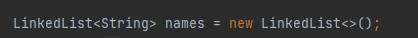

4. Tambahkan juga baris berikut ini, untuk memberikan perbedaan dari tampilan yang sebelumnya
```java
names.push("Mei-Mei");
System.out.printf("Elemen 0: %s total elemen: %s elemen terakhir: %s\n", names.getFirst(),
        names.size(), names.getLast());
System.out.println("Names: " + names.toString());
```
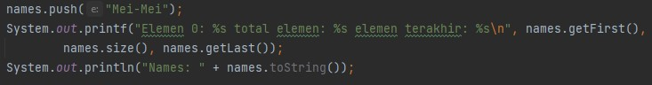

5. Dari penambahan kode tersebut, silakan dijalankan dan apakah yang dapat Anda jelaskan!

**Penambahan Kode push pada soal no 4 untuk menambah data dari depan**

## SubBab 16.3.3. 
1. Apakah perbedaan fungsi push() dan add() pada objek fruits?
   
   **fungsi push untuk menambahkan data dari depan, sedangkan add untuk menambah data dari belakang**

2. Silakan hilangkan baris 43 dan 44, apakah yang akan terjadi? Mengapa bisa demikian?

   **Stack tidak akan terisi data baru, karena semua elemen stack baru saja dihapus**

3. Jelaskan fungsi dari baris 46-49?

   **Baris tersebut berfungsi untuk mencetak elemen data pada stack menggunakan konsep perulangan foreach**

4. Silakan ganti baris kode 25, Stack<String> menjadi List<String> dan apakah yang terjadi?
   Mengapa bisa demikian?

   **Terjadi error karena yang dapat dijadikan object adalah percabangan dari List, bukan List itu sendiri.**

5. Ganti elemen terakhir dari dari objek fruits menjadi “Strawberry”!

6. Tambahkan 3 buah seperti “Mango”,”guava”, dan “avocado” kemudian dilakukan sorting!

```java
package ContohList;

import java.util.Iterator;
import java.util.Stack;

public class LoopCollection {
   public static void main(String[] args) {
      //Bagian generic ga disingkat. ex: Integer not int
      Stack<String>fruits = new Stack<>();
      fruits.push("Banana");
      fruits.add("Orange");
      fruits.add("Watermelon");
      fruits.add("Leci");
      fruits.push("Salak");

      for(String fruit : fruits){
         System.out.printf("%s ", fruit);
      }
      System.out.println("\n" + fruits.toString());

      while(!fruits.empty()){
         System.out.printf("%s ", fruits.pop());
      }

      //fruits.push("Melon");
      //fruits.push("Durian");
      System.out.println("");
      for(Iterator <String> it = fruits.iterator(); it.hasNext();){
         String fruit = it.next();
         System.out.printf("%s ", fruit);
      }
      System.out.println("");
      fruits.stream().forEach(e ->{
         System.out.printf("%s ",e);
      });
      System.out.println("");
      for(int i=0; i<fruits.size(); i++){
         System.out.printf("%s", fruits.get(i));
      }
   }
}
```

Output:

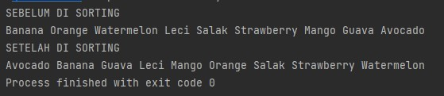


## Sub Bab 16.4.3. 
1. Pada fungsi tambah() yang menggunakan unlimited argument itu menggunakan konsep apa?
   Dan kelebihannya apa?

   **Menggunakan konsep Arrays.asList pada parameternya. Dalam konsep ini panjang arraynya akan sama dengan data yg diinputkan. Kelebihan dari konsep ini adalah lebih fleksibel dalam penambahan atau pengurangan elemennya apabila ada suatu kasus yang tidak diketahui berapa pastinya banyak elemennya**
  
2. Pada fungsi linearSearch() di atas, silakan diganti dengan fungsi binarySearch() dari collection!
```java
int BinarySearch(String nim){
        for(int i=0; i<mahasiswas.size(); i++){
            if(nim.equals(mahasiswas.get(i).nim)){
                return i;
            }
        }
        return -1;
    }

```

4. Tambahkan fungsi sorting baik secara ascending ataupun descending pada class tersebut!
```java
    void ascendingSort(){
        this.mahasiswas.sort((Mahasiswa dl, Mahasiswa d2) -> dl.nim.compareTo(d2.nim));
    }
    void descendingSort(){
        this.mahasiswas.sort((Mahasiswa dl, Mahasiswa d2) -> d2.nim.compareTo(dl.nim));
    }
```

Main: 
```java
    public static void main(String[] args) {
        ListMahasiswa lm = new ListMahasiswa();
        Mahasiswa m = new Mahasiswa("201234", "Noureen", "021xx1");
        Mahasiswa m1 = new Mahasiswa("201235", "Akhleema", "021xx2");
        Mahasiswa m2 = new Mahasiswa("201236", "Shannum", "021xx3");
        Mahasiswa m3 = new Mahasiswa("201237", "Desy", "021xx4");
        Mahasiswa m4 = new Mahasiswa("201238", "Ayu", "021xx5");
        Mahasiswa m5 = new Mahasiswa("201232", "Rian", "021xx7");

        //menambahkan objek mahasiswa
        lm.tambah(m, m1, m2, m3, m4, m5);
        //menampilkan list mahasiswa
        lm.tampil();
        //update mahasiswa
        lm.update(lm.BinarySearch("201235"), new Mahasiswa("201235", "Akhleema Lela", "021xx2"));
        lm.hapus(1);
        System.out.println("");
        lm.tampil();
        System.out.println("");
        System.out.println("Sorting Ascending");
        lm.ascendingSort();
        lm.tampil();
        System.out.println("");
        System.out.println("Sorting Descending");
        lm.descendingSort();
        lm.tampil();

    }
```
Output: 

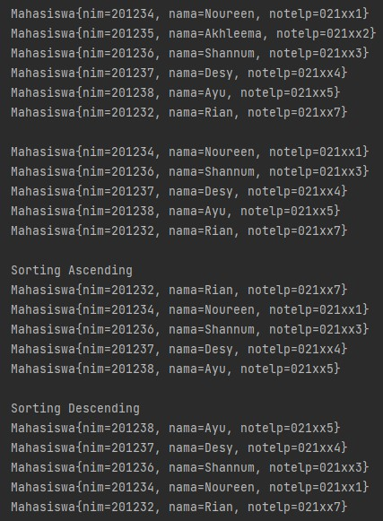

## Tugas 

1. Source Code 

Class Film: 
```java
package Tugas1;

public class Film {
    String idFilm, judulFilm, tahunTayang, director;

    Film(String idFilm, String judulFilm, String tahunTayang, String director){
        this.idFilm=idFilm;
        this.judulFilm=judulFilm;
        this.tahunTayang=tahunTayang;
        this.director=director;
    }

    @Override
    public String toString(){
        return "Film{" + "ID Film=" + idFilm + ", Judul Film=" +judulFilm+", Tahun Tayang="+tahunTayang+", Director=" +director+'}';
    }

}
```

Class List Film and Main 
```java
package Tugas1;
import java.util.Scanner;
import java.util.Iterator;
import java.util.List;
import java.util.Stack;

public class ListFilm{
    List<Film> film = new Stack<>();

    public void push(Film films){
        film.add(films);
    }

    public void pop(){
        for(Iterator<Film> it = film.iterator(); it.hasNext();){
            Film films = it.next();
            if (!it.hasNext()) {
                System.out.println("Film{ID Film="+films.idFilm+", Judul Film="+films.judulFilm+", Tahun Tayang="+films.tahunTayang+", Director="+films.director+"}");
            }
        }
        film.remove(film.size()-1);
    }

    public void peek(){
        for(Iterator<Film> it = film.iterator(); it.hasNext();){
            Film films = it.next();
            if (!it.hasNext()) {
                System.out.println("Film{ID Film="+films.idFilm+", Judul Film="+films.judulFilm+", " + "Tahun Tayang="+films.tahunTayang+", Director="+films.director+"}");
            }
        }
    }

    public void tampil(){
        film.stream().forEach(f -> {
            System.out.println("" + f.toString());
        });
    }

    public static void main(String[] args) {
        ListFilm df = new ListFilm();
        Scanner sc = new Scanner(System.in);
        Scanner input = new Scanner(System.in);
        String tambah;

        int i=0;
        while(i<1){
            System.out.println("============================");
            System.out.println("Daftar Film Layar Lebar");
            System.out.println("============================");
            System.out.println("1. Input Data Film");
            System.out.println("2. Hapus Data Film Teratas");
            System.out.println("3. Cek Data Film Teratas");
            System.out.println("4. Info Semua Data Film");
            System.out.println("5. Keluar");
            System.out.println("============================");
            System.out.print("Pilih : ");
            int pilih = sc.nextInt();
            sc.nextLine();

            if (pilih==1) {
                do{
                    System.out.print("ID Film : ");
                    String idFilm = input.nextLine();
                    System.out.print("Judul Film : ");
                    String judulFilm = input.nextLine();
                    System.out.print("Tahun Tayang : ");
                    String tahunTayang = input.nextLine();
                    System.out.print("Director : ");
                    String director = input.nextLine();
                    Film film = new Film(idFilm, judulFilm, tahunTayang, director);
                    df.push(film);
                    System.out.println("Ingin menambah data film lagi? (y/n)");
                    tambah = sc.next();
                }while (tambah.equalsIgnoreCase("y"));
            } else if (pilih==2) {
                df.pop();
            } else if (pilih==3) {
                df.peek();
            } else if (pilih==4) {
                df.tampil();
            } else {
                i++;
            }
        }
    }
}
```


Output:

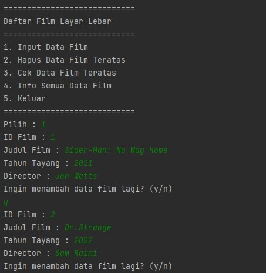
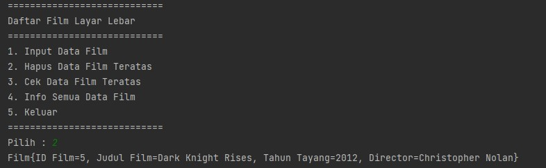
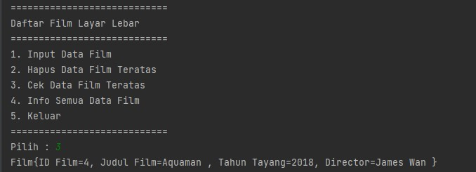
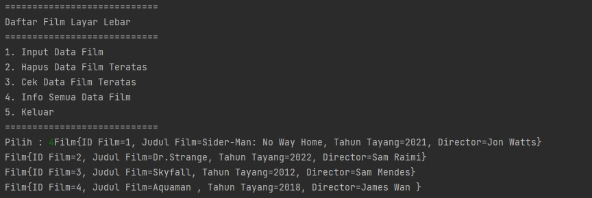
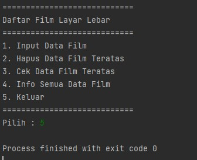


2. Source Code 
Class ListNilai:
```java
package Tugas2;

import java.util.List;
import java.util.ArrayList;
import java.util.Iterator;

public class ListNilai{
    List<Mahasiswa> mahasiswas = new ArrayList<>();
    List<MataKuliah> mataKuliah = new ArrayList<>();
    List<Nilai> nilais = new ArrayList<>();

    public void add(Nilai nilai){
        nilais.add(nilai);
    }

    public void tampil(){
        nilais.stream().forEach(n -> {
            System.out.println("" + n.toString());
        });
    }

    public void get(String nim){
        for(Iterator<Nilai> it = nilais.iterator(); it.hasNext();){
            Nilai nilai = it.next();
            if (nim.equals(nilai.nim)) {
                System.out.println("NIM\t\t\tNama\t\tMata Kuliah\t\t\t\t\t\t\t\t\t\t\tSKS\tNilai");
                nilai.print();
                System.out.println("Total SKS " + nilai.sks + " telah diambil.");
            }
        }
    }

    public void sort(){
        Double[] urut = new Double[nilais.size()];
        int a=0;
        for (Nilai nilai : nilais) {
            urut[a] = nilai.nilai;
            a++;
        }
        for (int i = 0; i < urut.length-1; i++) {
            for (int j = 1; j < urut.length-i; j++) {
                if(urut[j-1] > urut[j]){
                    Double temp = urut[j-1];
                    urut[j-1] = urut[j];
                    urut[j] = temp;
                }
            }
        }
        for(int i=0; i<urut.length; i++){
            for (Nilai nilai : nilais) {
                if(nilai.nilai==urut[i]){
                    nilai.print();
                }
            }
        }
    }
}
```

Class MataKuliah:
```java
package Tugas2;

public class MataKuliah {
    String kode, mataKuliah, sks;

    MataKuliah(String kode, String mataKuliah, String sks){
        this.kode=kode;
        this.mataKuliah=mataKuliah;
        this.sks=sks;
    }

    public String toString(){
        return kode + "\t\t" + mataKuliah + "\t\t\t\t" + sks;
    }

    public void print(){
        System.out.println(kode+"\t\t"+mataKuliah+"\t\t\t\t"+sks);
    }
}
```

Class Mahasiswa: 
```java
package Tugas2;

public class Mahasiswa {
    String nim, nama, telp;

    Mahasiswa(String nim, String nama, String telp){
        this.nim=nim;
        this.nama=nama;
        this.telp=telp;
    }

    public String toString(){
        return nim + "\t\t" + nama + "\t\t" + telp;
    }

    public void print(){
        System.out.println(nim+"\t\t"+nama+"\t\t"+telp);
    }
}
```

Class Nilai and Main:
```java
package Tugas2;
import java.util.Scanner;
public class Nilai {
    String nim, nama, mataKuliah, sks;
    Double nilai;

    Nilai(String nim, String nama, String mataKuliah, String sks, Double nilai){
        this.nim=nim;
        this.nama=nama;
        this.mataKuliah=mataKuliah;
        this.sks=sks;
        this.nilai=nilai;
    }

    public String toString(){
        return nim + "\t\t" + nama + "\t\t" + mataKuliah + "\t\t\t" + sks + "\t" + nilai;
    }

    public void print(){
        System.out.println(nim+"\t\t"+nama+"\t\t"+mataKuliah+"\t\t\t"+sks+"\t"+nilai);
    }

    public static void main(String[] args) {
        Mahasiswa[] mhs = new Mahasiswa[6];
        MataKuliah[] mk = new MataKuliah[5];
        ListNilai ln = new ListNilai();
        Scanner sc = new Scanner(System.in);
        Scanner input = new Scanner(System.in);

        mhs[0] = new Mahasiswa("20001", "Thalhah", "\t\t\t021xxx");
        mhs[1] = new Mahasiswa("20002", "Zubair", "\t\t\t021xxx");
        mhs[2] = new Mahasiswa("20003", "Abdur-Rahman", "\t021xxx");
        mhs[3] = new Mahasiswa("20004", "Sa'ad", "\t\t\t021xxx");
        mhs[4] = new Mahasiswa("20005", "Sa'id", "\t\t\t021xxx");
        mhs[5] = new Mahasiswa("20006", "Ubaidah", "\t\t\t021xxx");

        mk[0] = new MataKuliah("00001", "Internet Of Things", "\t\t\t\t\t\t3");
        mk[1] = new MataKuliah("00002", "Algoritma dan Struktur Data", "\t\t\t\t3");
        mk[2] = new MataKuliah("00003", "Algoritma dan Pemrograman", "\t\t\t\t2");
        mk[3] = new MataKuliah("00004", "Praktikum Algoritma dan Struktur Data", "\t3");
        mk[4] = new MataKuliah("00005", "Praktikum Algoritma dan Pemrograman", "\t\t3");

        int i=0;
        while(i<1){
            System.out.println("**************************************");
            System.out.println("SISTEM PEMGOLAHAN DATA NILAI MAHASISWA");
            System.out.println("**************************************");
            System.out.println("1. Input Nilai");
            System.out.println("2. Tampil Nilai");
            System.out.println("3. Mencari Nilai Mahasiswa");
            System.out.println("4. Urut Data Nilai");
            System.out.println("5. Keluar");
            System.out.println("**************************************");
            System.out.print("Pilih : ");
            int pilih = sc.nextInt();
            sc.nextLine();

            if (pilih==1) {
                System.out.println("Masukkan Data :");
                System.out.print("Kode: ");
                int kodee = input.nextInt();
                System.out.print("Nilai : ");
                double nilai = input.nextDouble();
                input.nextLine();

                System.out.println("DAFTAR MAHASISWA");
                System.out.println("***********************************");
                System.out.println("NIM\t\t\tNama\t\t\t\t\tTelp");
                for (int j=0; j<mhs.length; j++) {
                    mhs[j].print();
                }
                System.out.print("Pilih Mahasiswa By NIM : ");
                String nim = input.nextLine();
                Mahasiswa x = null;
                for(int j=0; j<mhs.length; j++){
                    if(nim.equals(mhs[j].nim)){
                        x = mhs[j];
                    }
                }

                System.out.println("DAFTAR MATA KULIAH");
                System.out.println("***********************************");
                System.out.println("Kode\t\tMata Kuliah\t\t\t\t\t\t\t\t\t\t\t\tSKS");
                for (int j=0; j<mk.length; j++) {
                    mk[j].print();
                }
                System.out.print("Pilih Mata Kuliah By Kode : ");
                String kode = input.nextLine();
                MataKuliah y = null;
                for(int j=0; j<mk.length; j++){
                    if(kode.equals(mk[j].kode)){
                        y = mk[j];
                    }
                }


                Nilai nilaiobj = new Nilai(x.nim, x.nama, y.mataKuliah, y.sks, nilai);
                ln.add(nilaiobj);

            } else if (pilih==2) {
                System.out.println("DAFTAR MATA KULIAH");
                System.out.println("***********************************");
                System.out.println("NIM\t\t\tNama\t\tMata Kuliah\t\t\t\t\t\t\t\t\t\t\tSKS\tNilai");
                ln.tampil();

            } else if (pilih==3) {
                System.out.println("DAFTAR MATA KULIAH");
                System.out.println("***********************************");
                System.out.println("NIM\t\t\tNama\t\tMata Kuliah\t\t\t\t\t\t\t\t\t\t\tSKS\tNilai");
                ln.tampil();

                System.out.print("Masukkan Data Mahasiswa[NIM] : ");
                String nim = input.nextLine();
                ln.get(nim);

            } else if (pilih==4) {
                System.out.println("DAFTAR MATA KULIAH");
                System.out.println("***********************************");
                System.out.println("NIM\t\t\tNama\t\tMata Kuliah\t\t\t\t\t\t\t\t\t\t\tSKS\tNilai");
                ln.sort();

            } else {
                i++;
            }
        }
    }
}
```

Output


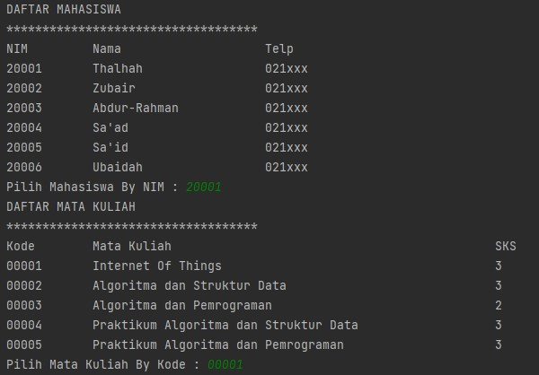
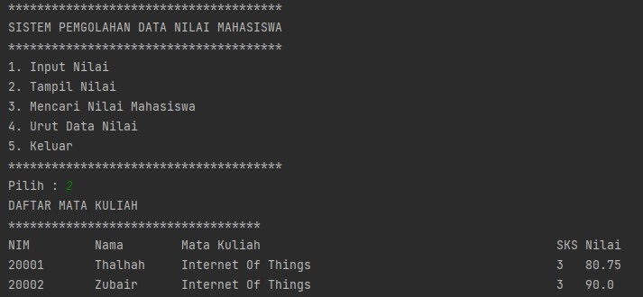
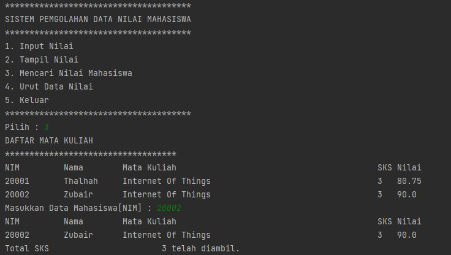
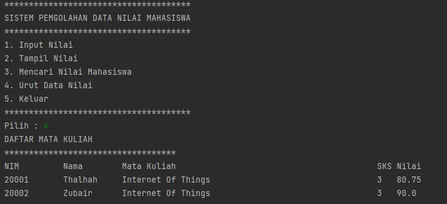


