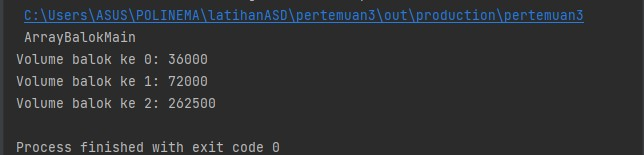
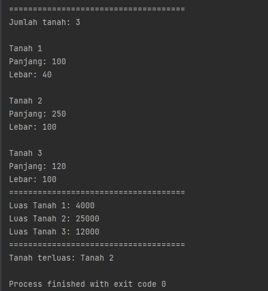

# Laporan Praktikum Pertemuan 3 
oleh Desy Ayuranti - 10 - 2141720119 - (TI -1G)
## SubBab 3.2.2 
Verifikasi Hasil Percobaan


## SubBab 3.2.3 Pertanyaan 
1. Berdasarkan uji coba 3.2, apakah class yang akan dibuat array of object harus selalu memiliki
   atribut dan sekaligus method?Jelaskan!

   **Ya, setiap kelas yang akan dibuat array of object harus memiliki atribut akan tetapi setiap atribut tidak harus memiliki method. Contohnya pada uji coba 3.2 yang memiliki atribut panjang dan lebar akan tetapi atribut tersebut tidak memiliki method. Kita harus mengisikan nilai pada atribut tersebut**
2. Apakah class PersegiPanjang memiliki konstruktor?Jika tidak, kenapa dilakukan pemanggilan konstruktur pada baris program berikut :

   **Tidak memiliki konstruktor, pemanggilan konstruktor dilakukan untuk membuat object PersegiPanjang pada array indeks 1**
3. Apa yang dimaksud dengan kode berikut ini:

   **Kode tersebut merupakan pembuatan array dari objek PersegiPanjang. Kode diatas membuat array ppArray yang dapat menampung 3 objek PersegiPanjang**
4. Apa yang dimaksud dengan kode berikut ini:

   **Kode tersebut merupakan pembuatan objek array. Sebelum instance, kita harus membuat objek array terlebih dahulu setelah itu baru bisa mengisikan nilai pada array indeks ke-1 yaitu dengan panjang =80 dan lebar =40**
5. Mengapa class main dan juga class PersegiPanjang dipisahkan pada uji coba 3.2?

   **Agar dapat mencerminkan mana class untuk objek itu sendiri dan mana class untuk main**


## SubBab 3.3.2 
Verifikasi Hasil Percobaan


## SubBab 3.3.3 Pertanyaan 
1. Apakah array of object dapat diimplementasikan pada array 2 Dimensi?

   **Bisa, array of object bisa diimplementasikan pada array 2 dimensi**
2. Jika jawaban soal no satu iya, berikan contohnya! Jika tidak, jelaskan!

``` java
bukuIlmiah[][] arrBuku = new bukuIlmiah[5][4];

for(int i=0; i<bukuIlmiah.length; i++){
   for(int j=0; j<bukuIlmiah[0].length; j++){
      arrBuku[i][j] = new bukuIlmiah();
   }
}

```
3. Jika diketahui terdapat class Persegi yang memiliki atribut sisi bertipe integer, maka kode dibawah ini akan memunculkan error saat dijalankan. Mengapa?

      **Error karena belum dibuat objek array. Perlu ditambahkan sintax sbb:**
```
pgArray [5] = new Persegi();
```

5. Modifikasi kode program pada praktikum 3.3 agar length array menjadi inputan dengan Scanner!
   
   **Modifikasi program**

   
6. Apakah boleh Jika terjadi duplikasi instansiasi array of objek, misalkan saja instansiasi dilakukan
   pada ppArray[i] sekaligus ppArray[0]?Jelaskan !

   **Boleh, akan tetapi program menjadi kurang efisien. Agar lebih efisien, kita bisa menggunakan perulangan untuk instansiasi array of objek**


## SubBab 3.4.2 
Verifikasi Hasil Percobaan


## SubBab 3.4.3 Pertanyaan
1. Dapatkah konstruktor berjumlah lebih dalam satu kelas? Jelaskan dengan contoh!

   **Ya, konstruktor boleh berjumlah lebih dari 1**
```
class kubus{
    public int sisi;

    public kubus(int s){
        sisi = s;
    }
    public int lpKubus(){
        return 6*sisi*sisi;
    }
    public int vKubus(){
        return sisi*sisi*sisi;
    }
}
```
   **Sintax di atas memiliki lebih dari 1 konstruktor dalam satu class. konstruktor kubus yang menggunakan parameter dan konstruktor lpKubus dan vKubus yang tidak menggunakan parameter**
2. Jika diketahui terdapat class Segitiga seperti berikut, Tambahkan konstruktor pada class Segitiga tersebut yang berisi parameter int a, int t
   yang masing-masing digunakan untuk mengisikan atribut alas dan tinggi.

   
   
3. Tambahkan method hitungLuas() dan hitungKeliling() pada class Segitiga
   tersebut.

   
   
4. Pada fungsi main, buat array Segitiga sgArray yang berisi 4 elemen, isikan masing-masing
   atributnya sebagai berikut:
   sgArray ke-0 alas: 10, tinggi: 4
   sgArray ke-1 alas: 20, tinggi: 10
   sgArray ke-2 alas: 15, tinggi: 6
   sgArray ke-3 alas: 25, tinggi: 10

   
   
5. Kemudian menggunakan looping, cetak luas dan keliling dengan cara memanggil method
   hitungLuas() dan hitungKeliling().

   

## 3.5 Latihan Praktikum 
1. Kode Program:

   
   
   
   
   
   Output:

   
   
   
   

2. Kode Program:

   
   

   Output:

   
   

3. Kode Program:

   
   

   Output:

   
   

  
