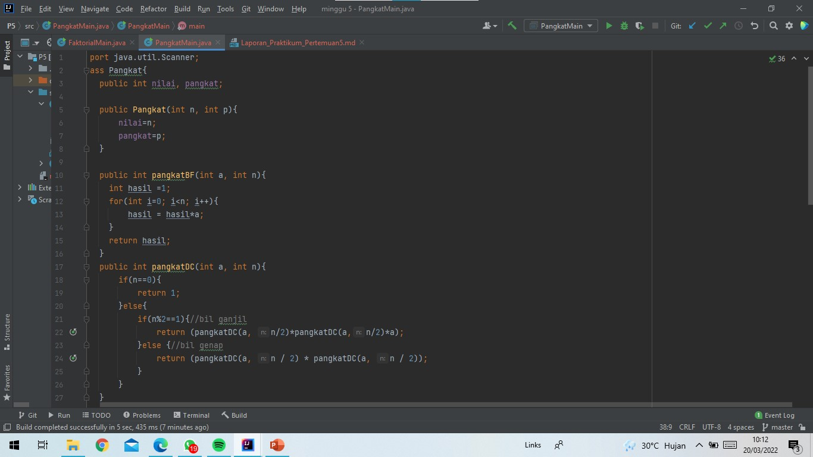

#Laporan Praktikum Pertemuan 5 
oleh Desy Ayurianti - (TI 1G / 10) - 2141720119 

###SubBab 4.2.3 Pertanyaan 
1. Base line if(n==1) adalah sebagai batas. Jika n sudah mencapai 1 maka akan return nilai 1 sesuai dengan konsep pada faktorial. Jika n masih belum mencapa batas base line ini, artinya lebih dari 1 maka akan tetap dikalikan dengan menggunakan penyelesaian rekursif yaitu n dikalikan faktorialDC(n-1)
2. Sudah 3 tahapan yaitu: 

    a. Divide: faktorialDC(n-1) syntax ini termasuk divide karena ada pengurangan pada nilai n (n-1)

    b. Conquer: int fakto = n*faktorialDC(n-1); syntax ini termasuk conquer karena sudah menerapkan penyelesaian faktorial menggunakan cara rekursif

    c. Combine: int fakto = n*faktorialDC(n-1); sytex ini termasuk combine karena perhitungan dari cara rekursif dikaliakan dengan nilai n. Jadi ada kombinasi antara cara rekursif dengan perkalian nilai n itu sendiri
3. Bisa dibuktikan dengan perulangan while dan do while : 
``` java
        int i=1;
        while(i<=n){        //perulangan while
            fakto=fakto*i;
            i++;
        }
        return fakto;
```
```java
        int i=1;            //perulangan do while
        do{
        fakto=fakto*i;
        i++;
        }
        while (i<=n);
        return fakto;
```
4. 
5. Ya, ada perubahan. Waktu eksekusi dengan menggunakan Divide Conquer jauh lebih cepat dari Brute Force

   
   
   


###SubBab 4.3.3 Pertanyaan
1. Method PangkatBF menggunakan syntax perulangan for dimana akan melakukan perulangan terhadap sekelompok intruksi. Perulangan ini akan terus berulangan apabila masih memenuhi syarat, jika sudah tidak memenuhi syarat maka perulangan akan dihentikan. Sedangkan method PangkatDC menggunakan fungsi rekursif, dimana dalam fungsi ini ada perintah untuk memanggil fungsi itu sendiri maka dari itu proses pemanggilan fungsi akan terjadi berulang-ulang.
2. Maksud dari potongan method PangkatDC apabila nilai pemangkat (n) jumlahnya ganjil (n%2==1) maka akan terjadi perkalian antar method itu pangkatDC itu sendiri akan tetapi nilai n menggunakan hasil n/2(variabel n yg dipakai dibagi 2) kemudian dikalikan dengan nilai yg dipangkatkan (a). Sedangkan apabila nilai pemangkat itu jumlahnya genap (n) maka terjadi perkalian antara method pangkatDC dengan tanpa menggunakan hasil n dibagi 2 (nilai n yg digunkan tetap n) dan tidak dikalikan dengan bilangan yg dipangkatkan
3. Tahap combine sudah ada yaitu:
   ```java
   return (pangkatDC(a, n/2)*pangkatDC(a,n/2)*a);
   // dan 
   return (pangkatDC(a, n / 2) * pangkatDC(a, n / 2));
   ```
4.  
    
5. Modifikasi Tambahan Menu dengan code: 
```java
import java.util.Scanner;
class Pangkat{
   public int nilai, pangkat;

   public Pangkat(int n, int p){
      nilai=n;
      pangkat=p;
   }

   public int pangkatBF(int a, int n){
      int hasil =1;
      for(int i=0; i<n; i++){
         hasil = hasil*a;
      }
      return hasil;
   }
   public int pangkatDC(int a, int n){
      if(n==0){
         return 1;
      }else{
         if(n%2==1){//bil ganjil
            return (pangkatDC(a, n/2)*pangkatDC(a,n/2)*a);
         }else {//bil genap
            return (pangkatDC(a, n / 2) * pangkatDC(a, n / 2));
         }
      }
   }
}
public class PangkatMain {
   public static void main(String[] args) {
      Scanner sc = new Scanner(System.in);
      System.out.println("==========================================================");
      System.out.print("Masukkan jumlah elemen yang ingin dihitung : ");
      int elemen = sc.nextInt();
      Pangkat [] png = new Pangkat[elemen];
      for(int i=0; i<elemen; i++){
         System.out.print("Masukkan nilai yang akan dipangkatkan ke-" +(i+1)+" : ");
         int nilai= sc.nextInt();
         System.out.print("Masukkan nilai pemangkat ke-" +(i+1)+" : ");
         int pangkat= sc.nextInt();
         png[i] = new Pangkat(nilai, pangkat);
      }
      for(;;){
         System.out.println("==========================================================");
         System.out.print("Menu Method \n1.BruteForce \n2.Divide Conquer \n3.Exit \nKetik angka 1 atau 2 untuk memilih:");
         int pilih =sc.nextInt();
         System.out.println("==========================================================");
         if (pilih==1){
            System.out.println("==========================================================");
            System.out.println("Hasil Pangkat dengan Brute Force");
            for(int i=0; i<elemen; i++){
               System.out.println("Nilai " + png[i].nilai + " pangkat " + png[i].pangkat + " adalah : " + png[i].pangkatBF(png[i].nilai, png[i].pangkat));
            }
         }
         else if (pilih==2){
            System.out.println("==========================================================");
            System.out.println("Hasil Pangkat dengan Divide Conquer");
            for(int i=0; i<elemen; i++){
               System.out.println("Nilai " + png[i].nilai + " pangkat " + png[i].pangkat + " adalah : " + png[i].pangkatDC(png[i].nilai, png[i].pangkat));
            }
            System.out.println("==========================================================");
         }else if (pilih==3){
            break;
         }else{
            System.out.println("inputan anda salah !");
         }

      }


   }
}
```

Hasil Output: 

 
 


###SubBab 4.4.3 Pertanyaan
1. a. Perhitungan keuntungan method TotalBF() dilakukan dengan cara iteratif dengan syntax perulangan. Kode program ini lebih sederhana dan mudah dipahami
   
   b. Perhitungan keuntungan method TotaDC() kode ini lebih kompleks dari pada method TotalBF() akan tetapi cara ini lebih bisa diterapklan sampai ke persolana yang sulit, selain itu kode ini lebih efisien
2. Untuk membatasi nilai di belakang koma, bisa menggunakan syntax System.out.printf dan %.2f seperti berikut: 
```java
System.out.printf("Total keuntungan perusahaan selama " + sm.elemen + " bulan adalah = " +"%.2f", sm.totalBF(sm.keuntungan));
```
3. Terdapat return value untul mengembalikan nilai dari lsum, rsum, dan arr[mid] yang kemudian ketiga nilai tersebut ditambahkan 
4. Variabel mid dibutuhkan untuk menyimpan nilai tengah dari l dan r yang nantinya nilai ini akan digunakan return method TotalDC
5. ```java
   import java.util.Scanner;
   class Array {
   public int elemen[];
   public double keuntungan[];
   public double total;
   public int perusahaan[];

    Array(int elemen, int jmlh_peru){
        this.elemen=new int [elemen];
        this.keuntungan=new double[elemen];
        this.perusahaan=new int[jmlh_peru];
        this.total=0;
    }
    double totalBF(double arr[]){
        for(int i=0; i < elemen.length; i++){
            total =total+arr[i];
        }
        return total;
    }
    double totalDC(double arr[], int l, int r){
        if(l==r){
            return arr[l];
        }else if(l<r){
            int mid =(l+r)/2;
            double lsum = totalDC(arr, l, mid-1);
            double rsum = totalDC(arr, mid+1, r);
            return lsum + rsum +arr[mid];
        }
        return 0;
    }
   }
   public class SumArray {
   public static void main(String[] args) {
   Scanner sc = new Scanner(System.in);
   int e1=0;
   System.out.println("=========================================================");
   System.out.println("Program Menghitung Keuntungan Total (Satuan Juta. MIsal 5.9)");

        System.out.print("Masukkan jumlah perusahaan: ");
        int jmlh_peru= sc.nextInt();
        for(int i=0; i<jmlh_peru; i++){
            System.out.print("Masukkan jumlah bulan perusahaan ke-" +(i+1)+ " : ");
            int elm= sc.nextInt();
            e1= elm;
        }
        Array sm = new Array(e1,jmlh_peru);
        System.out.println("=========================================================");
        for(int i=0; i<jmlh_peru; i++){
            System.out.println("Keuntungan Perusahaan " +(i+1));
            for(int j=0; j<e1; j++){
                System.out.print("Masukkan keuntungan perusahaan bulan ke -" +(j+1)+" = ");
                sm.keuntungan[j]= sc.nextDouble();
            }
        }

        for(int i=0; i<jmlh_peru;i++){
            System.out.println("==========================================================");
            System.out.println("Keuntungan Perusahaan " + (i+1));
            System.out.println("Algoritma Brute Force");
            System.out.printf("Total keuntungan perusahaan ke-" + (i+1) + " adalah = " +sm.totalBF(sm.keuntungan));
            System.out.println("\n==========================================================");
            System.out.println("Algoritma Divide Conquer");
            System.out.println
            ("Total keuntungan perusahaan ke-" + (i+1)  + " adalah = " +sm.totalDC(sm.keuntungan, 0, sm.elemen[i]-1));
        }

    }
   }```
   
###SubBab 4.4.3 Latihan 
Kode Program:

 
 
 
 
