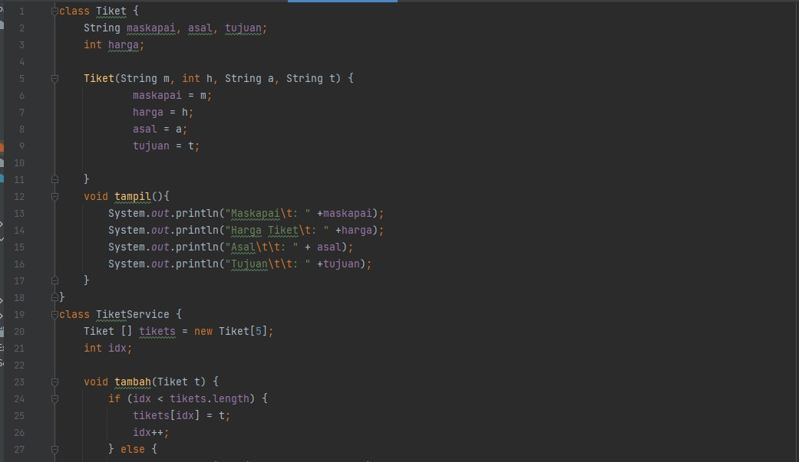
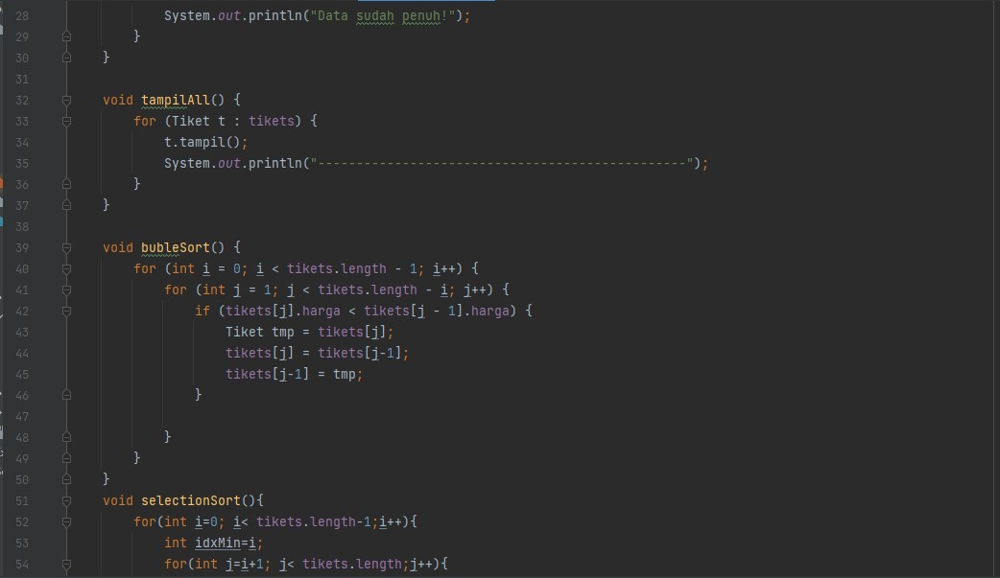
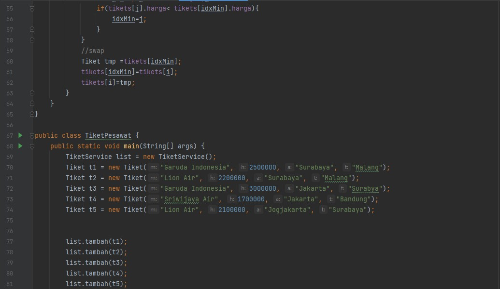
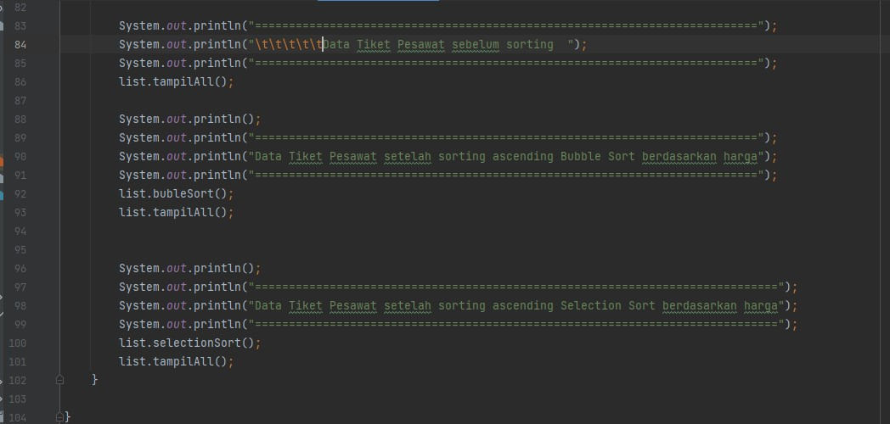
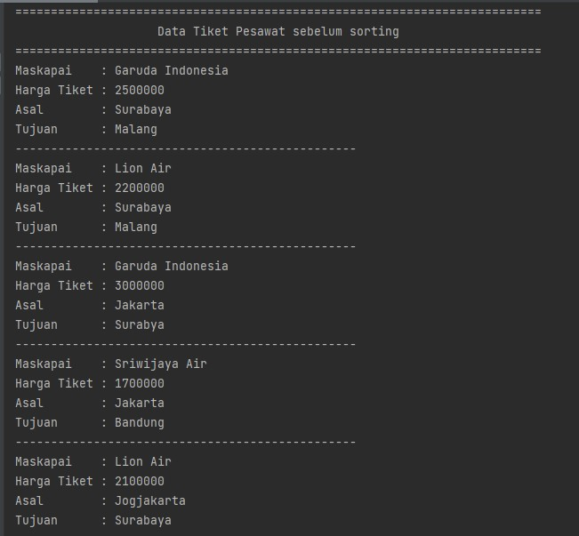
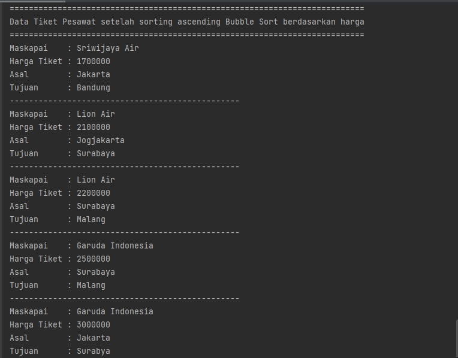
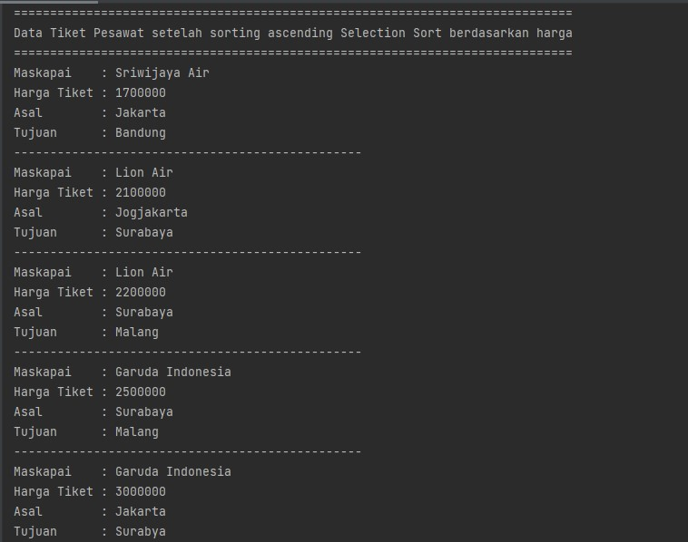

# Laporan Praktikum Pertemuan 6 
oleh Desy Ayurianti- (TI 1G)- 10 - 2141720119 

## SubBab5.2.3
1. Proses Buble Short terdapat pada method void bubbleSort pada class DaftarMahasiswaBerprestasi
2. Proses selection masih belum ada dalam method dan class
3. swap merupakan proses pertukaran tempat / indeks dari nilai. Nilai yang lebih besar akan dipindah posisinya ke kiri
4. Proses tersebut merupakan proses pertukaran indeks niai. jika nilai ipk indeks 1 lebih besar dari indeks 0 maka nilai ipk indeks ke 1 sekarang ada pada indeks 0
5. a. Perulangan i digunkan untuk mengulang indeks nilai yang digunakan sebagai kunci pemebanding
         Perulangan j digunakan untuk mengulang indeks nilai pembanding (nilai yang berada pada indeks setelah indeks kunci pembanding)
         Misal: 2,4,7,8 

         Maka i =2 , dan j =4 

   b. Alasan mengapa syarat i< listMhs.lengt-1 karena i dimulai dari indeks 0 dimana perulangan ini akan berulang sesuai dengan jumlah data -1
   
   c. Syarat j < listMhs.length-i karena j sendiri dimulai dari 1 sehingga agar tetap perulangan j ini sesuai dengan jumlah data, maka listMhs.length dikurang dengan i
      
      Misal i =0 dengan syarat i <listMhs.length-1 dan j = 1 dengan syarat j<list.Mhs.length-i
      
      Kita umpamakan jumlah data =4 maka: 
      i=0; i<4  maka 
      j=1; j<4 (karena masih perlu mengulang sampai indeks 3, jadi jika seperti ini masih sesuai dengan jumlah data) 
   
   d. perulangan i berlangsung 50, bubble sort melakukan perulangan 49


## SubBab5.3.3
Proses tersebut digunakan untuk mengurutkan nilai dari yang terkecil dengan menggunakan selection sort dimana ada variabel idxMin sebagai indeks dari kunci pembanding yang merupakan perulangan dari i. kemudian dilakukan perulangan lagi untuk nilai pembanding dari kunci pembandingnya dengan j yang dimulai dari i+1 dan syarat j tidak boleh lebih dari banyak nilai. Jika nilai indeks j lebih kecil dari nilai kunci pembanding (idxMin=i) maka idxMin sekarang indeksnya menjadi indeks dari j

Misal: 3,2,1 

maka idxMin adalah indeks ke-0 dengan nilai 3. j dimulai dari indeks ke-1 dengan nilai 2. karena nilai pada j kurang dari nilai pada idxMin, maka indeks idxMin sekarang berubah menjadi indeks j sehingga urutannya menjadi 2,3,1


## SubBab5.4.3
```java
void insertionSort(boolean asc){
        for(int i =1; i< listMhs.length;i++){
            Mahasiswa temp = listMhs[i];
            int j =i;
            if(asc){
                while(j>0 && listMhs[j-1].ipk >temp.ipk){
                    listMhs[j]=listMhs[j-1];
                    j--;
                }
            }else{
                while(j>0 && listMhs[j-1].ipk >temp.ipk){
                    listMhs[j]=listMhs[j-1];
                    j--;
                }
            }
            listMhs[j]=temp;
        }
    }
    
    // pemanggilan di Main: 
        System.out.println("\nData mahasiswa setelah sorting asc berdasarkan ipk");
        list.insertionSort(true);
        list.tampil();
```


## SubBab5.5 Latihan Praktikum 

Kode Program










