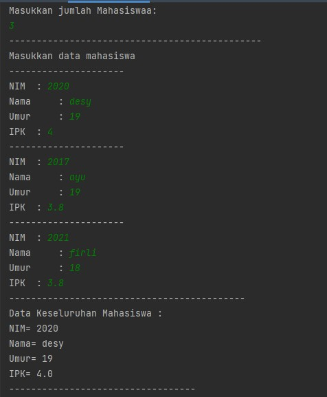

# Laporan Praktikum Pertemuan 7 
oleh Desy Ayurianti -(1G D4 TI)- 10 -2141720119


## SubBab 6.2.3. Pertanyaan 
1. Tampil Data digunakan untuk menampilkan data mahasiswa yang dicari menngunakan nim. Jika Tampil Posisi digunkan untuk menampilkan posisi NIM yang dicari ada pada indeks berapa. Untuk alur programnya sama yaitu menggunakan pemilihan jika posisi Nimnya tidak sama dengan -1(artinya NIM sudah ditemukan) maka akan ditampilkan posisinya di indeks berapa dan data mahasiswa juga ditampilka. Jika posisinya -1 maka print data tidak ditemuukan  
2. Fungsi break adalah apabila nim yang sudah dicari sudah ditemukan maka akan berhenti untuk melakukan perulangan lagi untuk mengecek data nim selanjutnya 
3. Masih bisa berjalan dan outpunya benar, karena program sequential search ini digunakan untuk mencari data saja, tidak berpengaruh pada pengurutan dari yang terkecil atau terbesar. Program ini hanya mencari NIM, jika NIM yang diinputkan sudah ditemukan maka akan ditampilkan data mahasiswa 

## SubBab 6.3.3 
1. Proses divide : 
```java 
mid = (left+right)/2;
```
2. Proses Conquer : 
```java 
if(cari==listMHS[mid].nim){
                return (mid);
            }else if(listMHS[mid].nim>cari){
                return FindBinarySearch(cari, left, mid-1);
            }else{

                return FindBinarySearch(cari, mid+1, right);
            }
```
3. Program tidak bisa berjalan. Karena teknik pencarian binary search data awal harus terurut sehingga proses sorting dilakukan terlebih dahulu dan dicari posisi tengahnya 
```java
mid = (left+right)/2;
```
4. ```java
   int FindBinarySearch(int cari, int left, int right){
        int mid;
        if(right>=left){
            mid = (left+right)/2;
            if(cari==listMHS[mid].nim){
                return (mid);
            }else if(listMHS[mid].nim>cari){
                return FindBinarySearch(cari, mid+1, right);
            }else{
                return FindBinarySearch(cari, left, mid-1);
            }

        }
        return -1;
   }
   ```
5. 
   ```java 
      import java.util.Scanner;
       class Mahasiswa{
       int nim;
       String nama;
       int umur;
       double ipk;

       Mahasiswa(int ni, String n, int u, double i){
           nim=ni;
           nama=n;
           umur=u;
           ipk=i;
       }
       void tampil(){
           System.out.println("NIM= "+nim);
           System.out.println("Nama= "+nama);
           System.out.println("Umur= "+umur);
           System.out.println("IPK= "+ipk);
       }
       }
       class PencarianMhs {
       Mahasiswa listMhs[];
       int idx;

       PencarianMhs(int length){
           this.listMHS=new Mahasiswa[length];
       }
       int jumlahMhs;

       void input(int j){
           jumlahMhs=j;
       }
       Mahasiswa []listMHS= new Mahasiswa[jumlahMhs];

       void tambah(Mahasiswa m){
           if(idx < listMHS.length){
               listMHS[idx]=m;
               idx++;
           }else{
               System.out.println("Data sudah penuh !");
           }
       }
       void tampil(){
           for(Mahasiswa m : listMHS){
               m.tampil();
               System.out.println("----------------------------------");
           }
       }
       int FindSeqSearch(int cari){
           int posisi=-1;
           for(int j=0; j< listMHS.length;j++){
               if(listMHS[j].nim==cari){
                   posisi=j;
               }

           }
           return posisi;
       }
       void Tampilposisi(int x, int pos){
           if(pos!=-1){
               System.out.println("data: " + x + " ditemukan pada indeks "+ pos);
           }else{
               System.out.println("data: " + x + " tidak ditemukan");
           }
       }
       void TampilData(int x, int pos){
           if(pos!=-1){
               System.out.println("NIM\t : "+x);
               System.out.println("Nama\t : "+listMHS[pos].nama);
               System.out.println("Umur\t : "+listMHS[pos].umur);
               System.out.println("IPK\t : "+listMHS[pos].ipk);
           }else{
               System.out.println("data " + x + " tidak ditemukan");
           }
       }

       int FindBinarySearch(int cari, int left, int right){
           int mid;
           if(right>=left){
               mid = (left+right)/2;
               if(cari==listMHS[mid].nim){
                   return (mid);
               }else if(listMHS[mid].nim>cari){
                   return FindBinarySearch(cari, left, mid-1);
               }else{

                   return FindBinarySearch(cari, mid+1, right);
               }

           }
           return -1;
           //Modifikasi Pertanyaan No 4 SubBab 6.3.3 --> memasukkan nim dari yan terbesar ke terkecil
           //if(right>=left){
               //mid = (left+right)/2;
               //if(cari==listMHS[mid].nim){
                   //return (mid);
               //}else if(listMHS[mid].nim>cari){
                   //return FindBinarySearch(cari, mid+1, right);
               //}else{
                   //return FindBinarySearch(cari, left, mid-1);
               //}

           //}
           //return -1;
       }

       }

       public class MahasiswaDanMain {
       public static void main(String[] args) {
       Scanner s = new Scanner(System.in);
       Scanner s1= new Scanner(System.in);
       System.out.println("Masukkan jumlah Mahasiswaa: ");
       int jum = s.nextInt();

           PencarianMhs data = new PencarianMhs(jum);

           System.out.println("----------------------------------------------");
           System.out.println("Masukkan data mahasiswa secara Urut dari NIM terkecil");
           data.input(jum);
           for(int i=0; i<jum; i++){
               System.out.println("---------------------");
               System.out.print("NIM\t : ");
               int nim= s.nextInt();
               System.out.print("Nama\t : ");
               String nama = s1.nextLine();
               System.out.print("Umur\t : ");
               int umur = s.nextInt();
               System.out.print("IPK\t : ");
               double ipk = s.nextDouble();

               Mahasiswa m = new Mahasiswa(nim, nama, umur, ipk);
               data.tambah(m);
           }

           System.out.println("-------------------------------------------");
           System.out.println("Data Keseluruhan Mahasiswa : ");
           data.tampil();

           System.out.println("___________________________________________");
           System.out.println("___________________________________________");
           System.out.println("Pencarian Data : ");
           System.out.println("Masukkan NIM Mahasiswa yang dicari: ");
           System.out.print("NIM : ");
           int cari = s.nextInt();
           System.out.println("Menggunakan Sequential Search");
           int posisi = data.FindSeqSearch(cari);
           data.Tampilposisi(cari, posisi);
           data.TampilData(cari, posisi);

           System.out.println("===========================================");
           System.out.println("Menggunkan binary search");
           posisi= data.FindBinarySearch(cari, 0, jum-1);
           data.Tampilposisi(cari, posisi);
           data.TampilData(cari, posisi);
       }
}
      ```
## SubBab 6.5 Latihan Praktikum 
1. Kode Program

   
   
   
   
   

   Output

   
   
   
   


2. Kode Program 


Output 


3. Kode Program

   
   
   
   
   
  

Output

   
   
   

