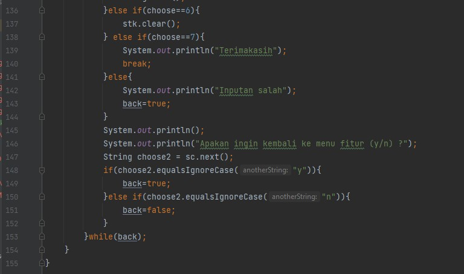

# Laporan Praktikum Pertemuan 9 
oleh Desy Ayurianti - 1G D4 TI - 10 - 2141720119 

## SubBab 7.2.3 
1. Berapa banyak data pakaian yang dapat ditampung di dalam stack? Tunjukkan potongan kode
   program untuk mendukung jawaban Anda tersebut!

**Data pakaian yang dpat ditampung adalah  5 data**
```java 
Stack stk = new Stack(5);
```
2. Perhatikan class StackMain, pada saat memanggil fungsi push, parameter yang dikirimkan adalah
   p. Data apa yang tersimpan pada variabel p tersebut?
```java
    stk,push(p);
```
**data yang tersimpah pada variabel p adalah data dari objek p yang memuat data jenis, warna, merk, ukuran, harga**
3.Apakah fungsi penggunaan do-while yang terdapat pada class StackMain?

**Fungsi penggunaan do while adalah untuk mengulang statement input data pakaian. Namun dalam sintaks do while ini, pengecekan kondisi dilakukan di akhir, sehingga statement input data pasti akan dijalankan paling tidak satu kali**
4. Modifikasi kode program pada class StackMain sehingga pengguna dapat memilih operasioperasi pada stack (push, pop, peek, atau print) melalui pilihan menu program dengan
   memanfaatkan kondisi IF-ELSE atau SWITCH-CASE!

```java
import java.util.Scanner;
class PakaianModif{
    String jenis, warna, merk, ukuran;
    double harga;

    PakaianModif(String jenis, String warna, String merk, String ukuran, double harga){
        this.jenis=jenis;
        this.warna=warna;
        this.merk=merk;
        this.ukuran=ukuran;
        this.harga=harga;
    }
}
class StackModif{
    int size, top;
    PakaianModif[] data;

    public StackModif(int size){
        this.size=size;
        data= new PakaianModif[size];
        top=-1;
    }
    public boolean IsEmpty(){
        if(top==-1){
            return true;
        }else{
            return false;
        }
    }
    public boolean IsFull(){
        if(top==size-1){
            return true;
        }else {
            return false;
        }
    }
    public void push(PakaianModif pkn){
        if(!IsFull()){
            top++;
            data[top]=pkn;
        }else{
            System.out.println("Isi stack penuh! ");
        }
    }
    public void pop(){
        if(!IsEmpty()){
            PakaianModif x = data[top];
            top--;
            System.out.println("Data yang keluar: " + x.jenis + " " + x.warna + " " + x.merk + " " +x.ukuran +" "+ x.harga);
        }else{
            System.out.println("Stack masih kosong");
        }
    }
    public void peek(){
        System.out.println("Elemen teratas: " + data[top].jenis + " " + " " + data[top].warna + " " + data[top].merk + " " + data[top].ukuran + " "+ data[top].harga);
    }
    public void print(){
        System.out.println("Isi Stack: ");
        for(int i = top; i>=0; i--){
            System.out.println(data[i].jenis + " " + data[i].warna + " " + data[i].merk + " "+ data[i].ukuran + " " + data[i].harga + " ");
        }
        System.out.println("");
    }
    public void clear(){
        if(!IsEmpty()){
            for(int i= top; i>=0; i++){
                top--;
            }
            System.out.println("Stack sudah dikosongkan");
        }else{
            System.out.println("Stack masih kosong");
        }
    }

}
public class PakaianDanMainModif {
    public static void main(String[] args) {
        StackModif stk = new StackModif(5);
        Scanner sc = new Scanner(System.in);

        boolean back=false;
        do{
            System.out.println("====Pilih Fitur====");
            System.out.println("1. Push");
            System.out.println("2. Pop");
            System.out.println("3. Peek");
            System.out.println("4. Print");
            System.out.println("6. Exit");
            System.out.print("Masukkan angka 1-5 untuk memilih fitur: ");
            int choose =sc.nextInt();
            if(choose==1){
                char pilih;
                sc.nextLine();
                do{
                    System.out.print("Jenis: ");
                    String jenis = sc.nextLine();
                    System.out.print("Warna: ");
                    String warna = sc.nextLine();
                    System.out.print("Merk: ");
                    String merk = sc.nextLine();
                    System.out.print("Ukuran: ");
                    String ukuran = sc.nextLine();
                    System.out.print("Harga: ");
                    double harga = sc.nextDouble();

                    PakaianModif p = new PakaianModif(jenis, warna, merk, ukuran, harga);
                    System.out.print("Apakah Anda akan menambahkan data baru ke stack (y/n) ? ");
                    pilih =sc.next().charAt(0);
                    sc.nextLine();
                    stk.push(p);

                }while(pilih=='y');

            }else if(choose==2){
                stk.pop();
            }else if(choose==3){
                stk.peek();
            }else if(choose==4) {
                stk.print();
            } else if(choose==5){
                System.out.println("Terimakasih");
                break;
            }else{
                System.out.println("Inputan salah");
                back=true;
            }
            System.out.println();
            System.out.println("Apakan ingin kembali ke menu fitur (y/n) ?");
            String choose2 = sc.next();
            if(choose2.equalsIgnoreCase("y")){
                back=true;
            }else if(choose2.equalsIgnoreCase("n")){
                back=false;
            }
        }while(back);

    }
}
```

## SubBab 7.3.3
1. Perhatikan class Postfix, jelaskan alur kerja method derajat!

**Pada method derajat terdapat sintaks pemilihan switch cas dimana terdapat variable c yang issinya adalah operator matematika. Pemilihan ini dilakukan untuk menentukan posisi operator saat pada postfix, apaka lebih besar atau lebih kecil derajatnya. Jika tedapat operator yang sama maka akan dijalankan sesuai dengan statement, jika tidak ada maka menggunanak default**
2. Apa fungsi kode program berikut?
```java
    c=Q.chrAt(i);
```
**Untuk memanggil nilai c berdasarkan nilai yang terakhir diinputkan pada variabel i**
3. jalankan kembali program tersebut, masukkan ekspresi 3*5^(8-6)%3. Tampilkan hasilnya!

4. Pada soal nomor 3, mengapa tanda kurung tidak ditampilkan pada hasil konversi? Jelaskan!

**tanda kurung tidak ditampilkan karena tanda kurung sebagai pembantu untuk mengoperasikan operasi dan operand yang lebih dulu dilakukan**

## TUGAS 
1. Perhatikan dan gunakan kembali kode program pada Praktikum 1. Tambahkan method getMin
   pada class Stack yang digunakan untuk mencari dan menampilkan data pakaian dengan harga
   terendah dari semua data pakaian yang tersimpan di dalam stack!

Kode Program




Output


2. Setiap hari Minggu, Dewi pergi berbelanja ke salah satu supermarket yang berada di area
   rumahnya. Setiap kali selesai berbelanja, Dewi menyimpan struk belanjaannya di dalam laci.
   Setelah dua bulan, ternyata Dewi sudah mempunyai delapan struk belanja. Dewi berencana
   mengambil lima struk belanja untuk ditukarkan dengan voucher belanja.
   Buat sebuah program stack untuk menyimpan data struk belanja Dewi, kemudian lakukan juga
   proses pengambilan data struk belanja sesuai dengan jumlah struk yang akan ditukarkan dengan
   voucher. Informasi yang tersimpan pada struk belanja terdiri dari:
   - Nomor transaksi
   - Tanggal pembelian
   - Jumlah barang yang dibeli
   - Total harga bayar
   Tampilkan informasi struk belanja yang masih tersimpan di dalam stack!

Kode Program 


Output 


