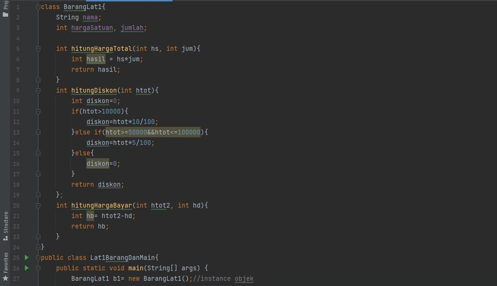
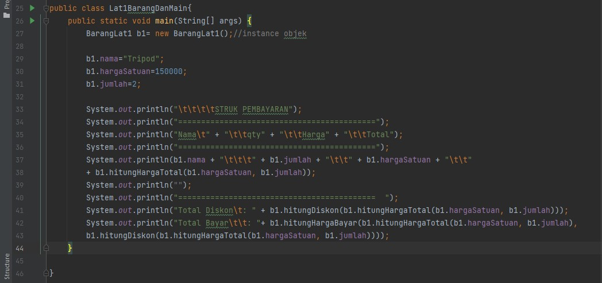
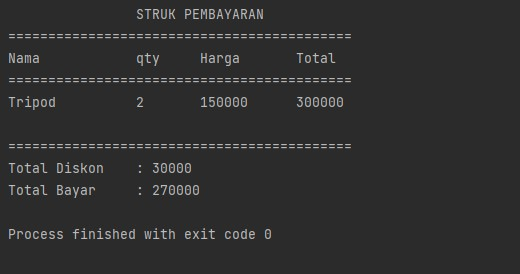
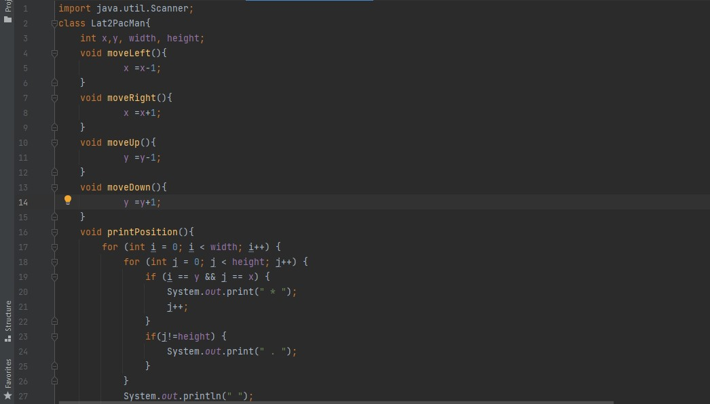
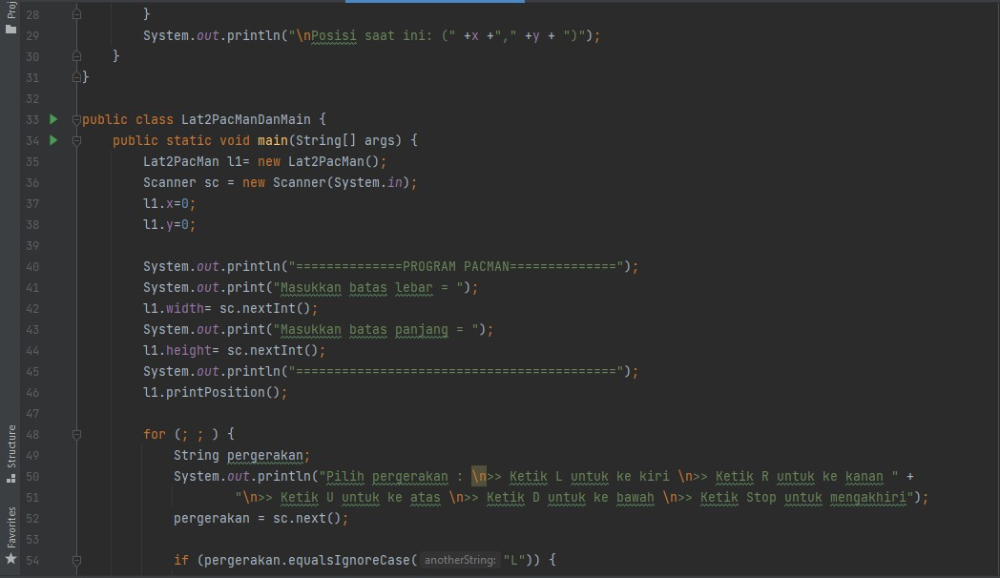
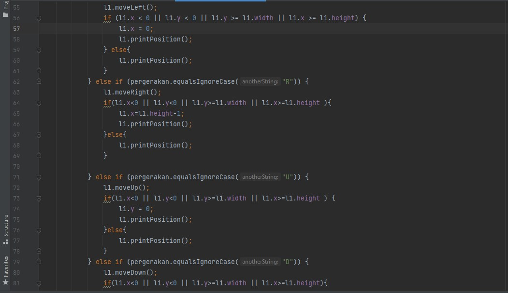
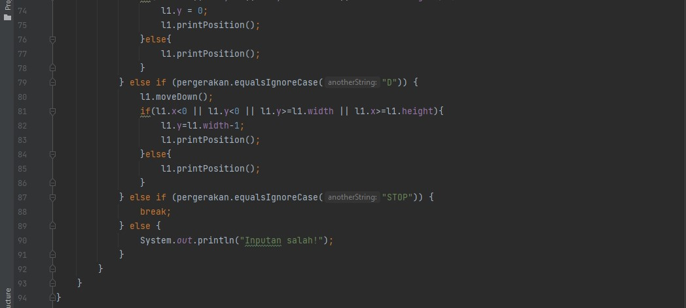
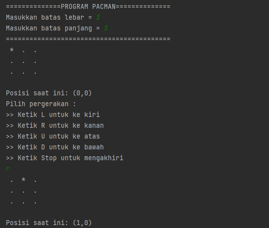
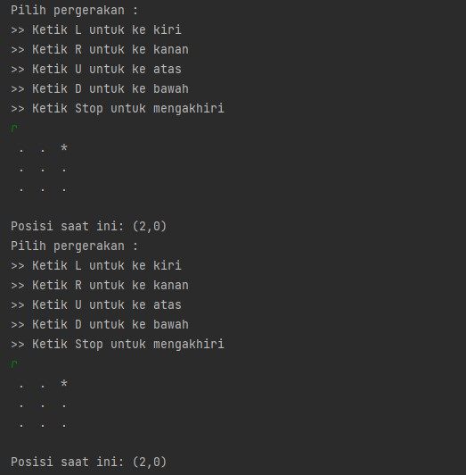
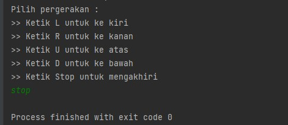

# Laporan Praktikum Pertemuan 2 

oleh Desy Ayurianti - 10 - 2141720119 - (TI-1G)

## SubBab 2.2.3 
1. Karakteristik class/ objek adalah memiliki atribut dan method 

2. Kata kunci mendeklarasikan class: 
menuliskan class kemudian diikuti dengan NamaClass

3. Ada 4 atribut class yaitu String namaBarang, String jenisBarang, int stok, dan int hargaSatuan. Ke-4 atribut ini dideklarasikan pada baris ke-13 dan ke-14 

4. Ada 4 method yaitu void tampilBarang(), void tambahStok(), void kurangiStok(), dan int hitungHargaTotal(jumlah: int). Method tersebut dideklarasikan pada baris 16 sampai 21, baris ke-23 sampai ke-25, baris ke-27 sampai 29, dan baris ke-31 sampai 33 

5. Modifikasi method kurangiStok() : 
void kurangiStok(int n){
    if(stok>0){
        stok=stok-n;
    }
}

6. Method tambahStok() dibuat dengan memiliki 1 parameter berupa bilangan int karena parameter digunakan untuk menyimpan nilai n (untuk menambah stok) dan menggunakan tipe data int karena jumlah barang dinyatakan dalam bilangan bulat tidak decimal

7. Method hitungHargaTotal() memiliki tipe data init karena sesuai dengan tipe data returnnya yaitu int  

8. Method tambahStok() memiliki tipe data void karena method ini tidak memiliki return dan tipe data void kosong

## SubBab 2.3.3
1. Proses Instansiasi dilakukan pada baris ke-15 dengan nama objek yang dihasilkan adalah b1

2. Cara mengakses atribut dan method dari suatu objek:
mengetikkan nama objek sesuai dengan nama yang sudah diinstansiasi kemudian diikuti dengan titik(.) dan diikuti dengan nama atribut atau nama method
contoh : b1.hargaSatuan , b1.tampilBarang();

## SubBab 2.4.3 
1. Deklarasi konstruktor berparameter dilakukan pada baris 18 

2. Baris tersebut melakukan instansiasi dengan konstruktor berparameter dengan nama objek b2 (memberikan nilai pada konstruktor berparameter)

3. Barang  b3 = new Barang("MacBook Air", "Apple MacBook", "10", "12000000")

## SubBab 2.5 Latihan Praktikum 
1. 
Kode Program

Output 

2. Kode Program

Output 

